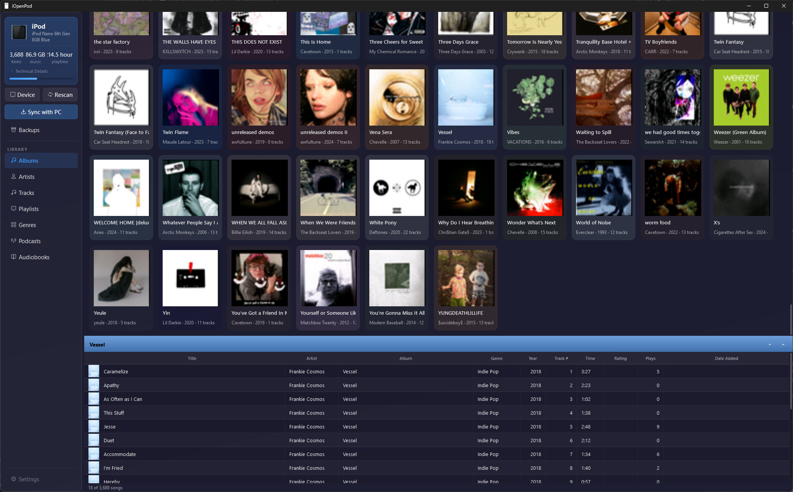
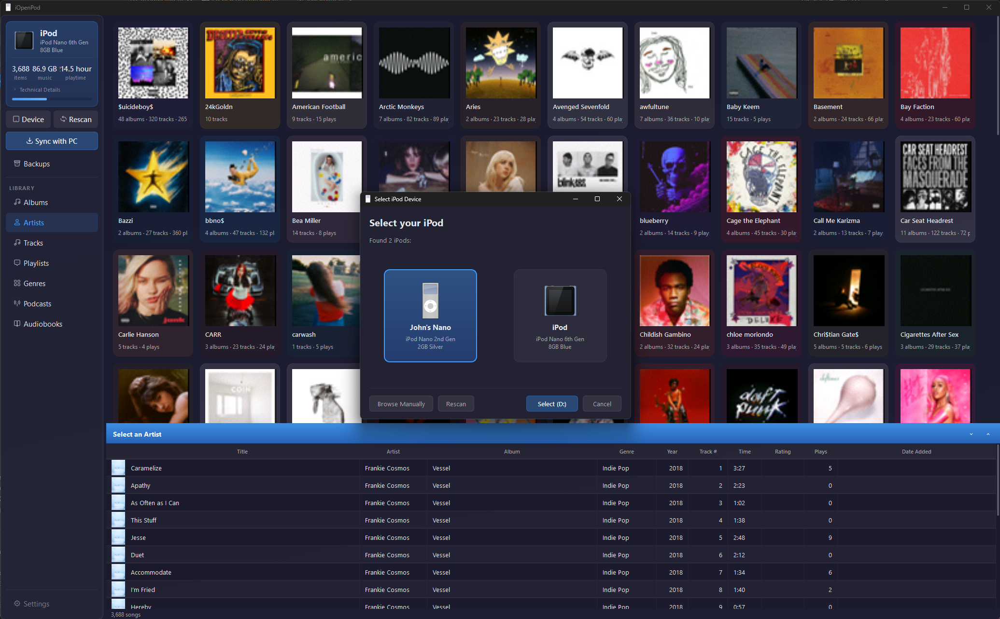
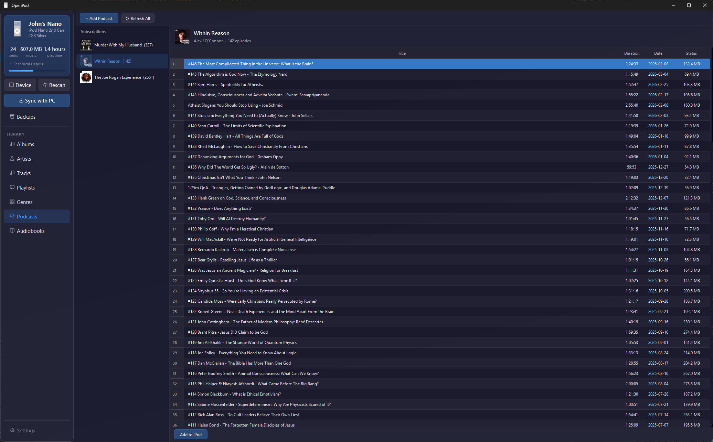
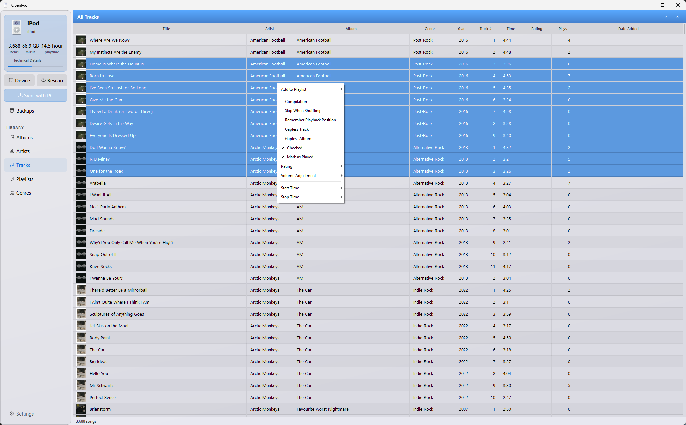
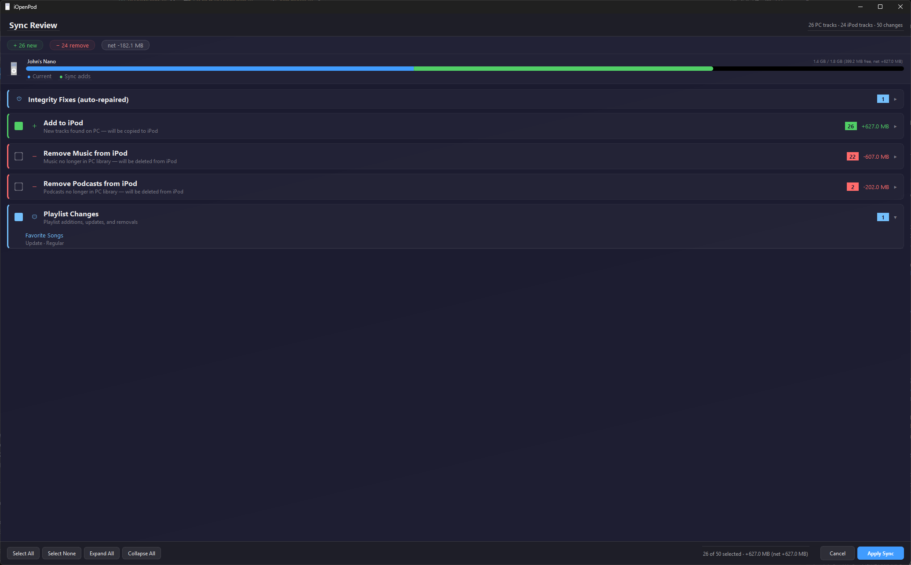
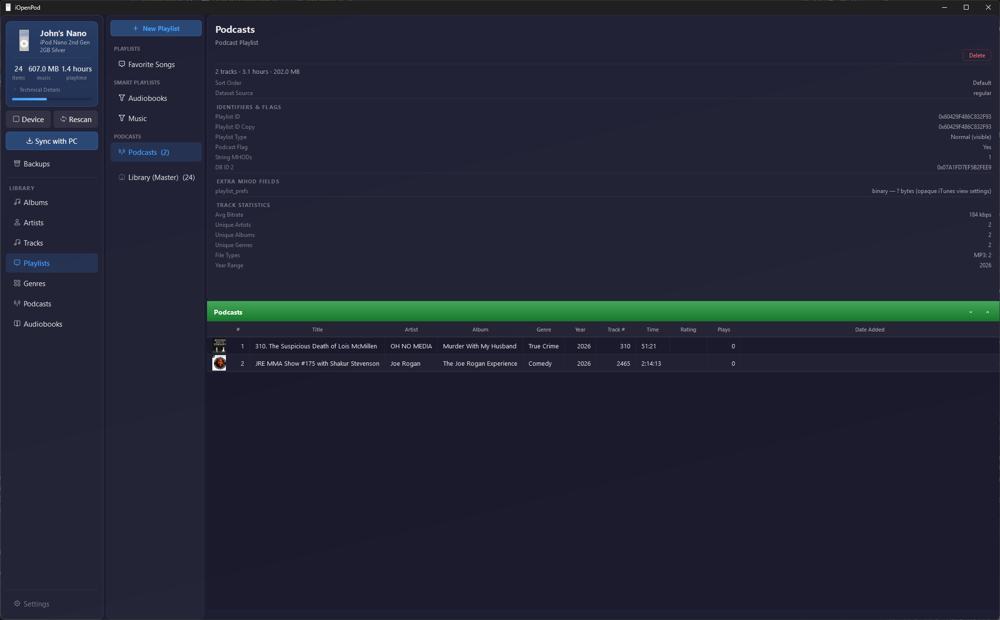
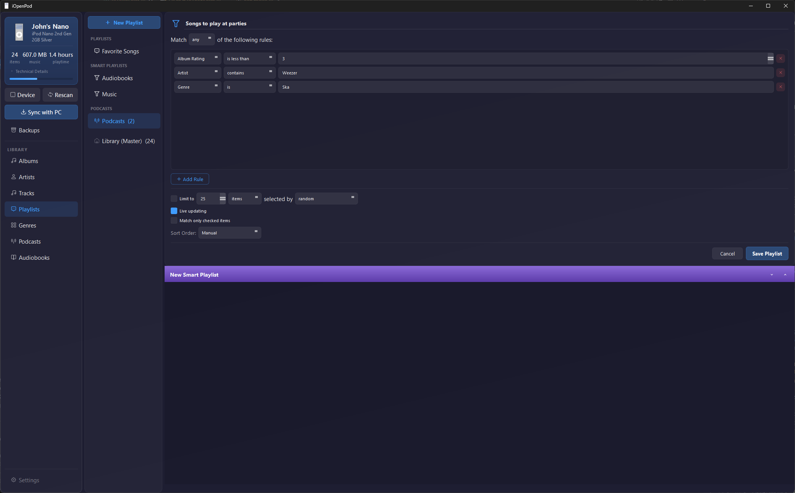
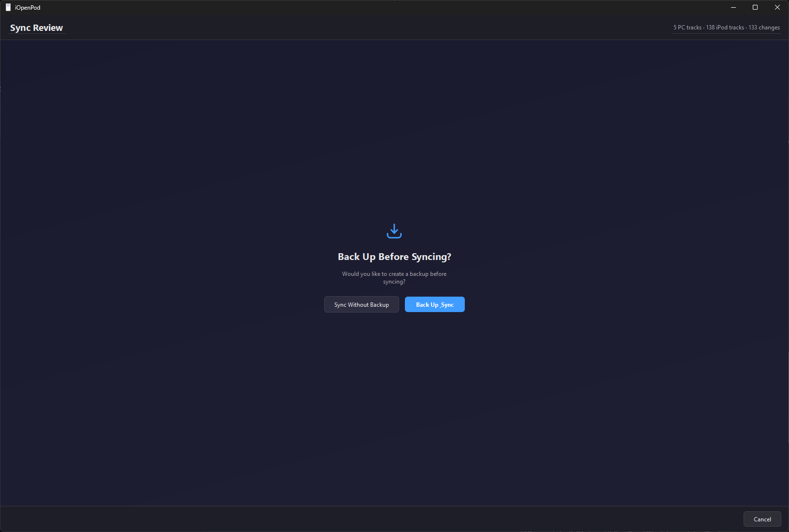
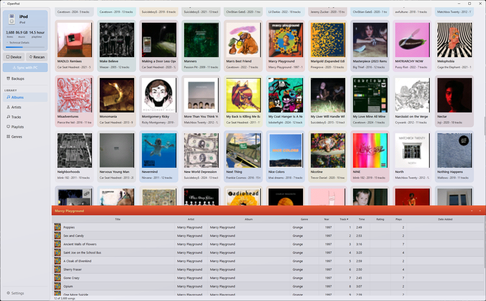

# iOpenPod

**Ditch iTunes. Sync your iPod the open way.**

[](LICENSE)
[](#download)
[](https://github.com/TheRealSavi/iOpenPod/releases/latest)

iOpenPod is a free, open-source desktop app that lets you manage your iPod without iTunes. Plug in your iPod, pick your music folder, and sync — FLAC, OGG, MP3, whatever you've got. It handles the conversion, the artwork, the playlists, all of it. Works on Windows, macOS, and Linux.



---

## Download

Grab the latest release for your platform — no Python required, no setup wizards, just download, extract, and run:

### ➡️ [Download iOpenPod](https://github.com/TheRealSavi/iOpenPod/releases/latest)

| Platform | File | Instructions |
|----------|------|-------------|
| **Windows** | `iOpenPod-windows.zip` | Extract the zip, run `iOpenPod.exe` |
| **macOS** | `iOpenPod-macos.tar.gz` | Extract, right-click `iOpenPod.app` → Open |
| **Linux** | `iOpenPod-linux.tar.gz` | Extract, run `./iOpenPod` |

Once installed, iOpenPod checks for updates automatically and can update itself right from the app.

> **Optional extras:** Install [FFmpeg](https://ffmpeg.org/) for transcoding (FLAC → ALAC, etc.) and [Chromaprint](https://acoustid.org/chromaprint) for acoustic fingerprinting.

---

## How to Use

1. **Plug in your iPod** — it mounts as a regular drive
2. **Pick your device** — iOpenPod detects connected iPods automatically
3. **Browse** — flip through albums, tracks, playlists, podcasts, and artwork
4. **Sync** — choose your music folder, review what'll change, and hit go



---

## Features

### 🎵 Sync Music From Any Format
Drop in FLAC, OGG, WMA, MP3, AAC — iOpenPod transcodes whatever the iPod can't play natively into ALAC or AAC. Converted files are cached so repeat syncs are fast.

### 📻 Podcasts
Subscribe to podcasts right inside iOpenPod with the built-in podcast manager. Search, subscribe, download episodes, and sync them to your iPod — all without a separate app.



### 🎧 ListenBrainz Scrobbling
Sign into ListenBrainz and your listening history gets scrobbled automatically every time you sync. Keep your music profile up to date without lifting a finger.

### 📚 More Than Just Music
Audiobooks, movies, and TV shows are all supported. iOpenPod handles the different media types so your iPod sorts them correctly.

### 🖱️ Drag and Drop
Don't care about keeping your PC and iPod perfectly in sync? Just drag files into the app and they'll land on your iPod — no sync setup required.



### 📊 Play Counts & Ratings
Listen on your iPod, plug it in, and your play counts, ratings, and skip counts sync back to your PC library. You pick the conflict strategy.

### 🖼️ Album Art Just Works
Art gets extracted from your files, resized, and written in the iPod's native RGB565 format. No extra steps.

### ✅ Review Before You Commit
Every sync shows you exactly what's happening — adds, removes, metadata updates — with checkboxes for each item. Nothing changes until you say so.



### 📋 Playlists & Smart Playlists
Browse and manage standard playlists. Smart playlists with rule-based filtering are supported too.




### 🛡️ Backup & Rollback
A snapshot of your iPod database is saved before every sync. If something goes wrong, roll back instantly with one click.



### 🌗 Light & Dark Mode
Choose between dark and light themes. The UI scales properly on high-DPI and low-res monitors alike.



### ⚙️ Configurable
Tweak transcoding settings, sync behavior, scrobbling, and more from the settings page.

---

## Supported iPods

Works with every click-wheel iPod Apple ever made. Shuffle support coming soon!

| Device | Status | Notes |
|--------|--------|-------|
| iPod 1G–5G, Mini, Photo | ✅ Fully supported | No hash required |
| iPod Classic (all gens) | ✅ Fully supported | Uses FireWire ID |
| iPod Nano 1G–2G | ✅ Fully supported | No hash required |
| iPod Nano 3G–4G | ✅ Fully supported | Uses FireWire ID |
| iPod Nano 5G | ✅ Fully supported | Needs one iTunes sync for HashInfo |
| iPod Nano 6G–7G | ✅ Fully supported | HASHAB via WebAssembly |
| iPod Shuffle | 🔜 Coming soon | |
| iPod Touch | ❌ Not planned | |

---

## For Developers

Want to hack on iOpenPod? Here's how to get a dev environment running.

### Prerequisites

- **Python 3.13+**
- **[uv](https://docs.astral.sh/uv/)** (Python package manager)
- **[FFmpeg](https://ffmpeg.org/)** (for transcoding)
- **[Chromaprint](https://acoustid.org/chromaprint)** (for fingerprinting)

### Setup

```bash
git clone https://github.com/TheRealSavi/iOpenPod.git
cd iOpenPod
uv sync
uv run python main.py
```

That's it. `uv sync` installs all dependencies into a virtual environment automatically.

### Project Layout

```
iOpenPod/
├── GUI/                    # PyQt6 interface
│   ├── app.py              # Main window, device management
│   └── widgets/            # Album grid, track list, sidebar, sync review, etc.
├── iTunesDB_Parser/        # Reads iPod's binary iTunesDB
├── iTunesDB_Writer/        # Writes iTunesDB with hash/checksum support
├── ArtworkDB_Parser/       # Reads ArtworkDB binary format
├── ArtworkDB_Writer/       # Writes album art to .ithmb files
├── SyncEngine/             # Fingerprinting, diffing, transcoding, sync execution
├── PodcastManager/         # Podcast search, subscription, and download
├── SQLiteDB_Writer/        # SQLite DB for Nano 6G/7G
└── main.py                 # Entry point
```

### How Sync Works

The sync engine matches tracks between your PC and iPod using acoustic fingerprints ([Chromaprint](https://acoustid.org/chromaprint)). This means it can identify the same song even after re-encoding, format conversion, or metadata changes.

1. Scan both the PC music folder and iPod's iTunesDB
2. Compute or read cached fingerprints for each track
3. Diff by fingerprint to classify: new, removed, changed, or matched
4. Present the sync plan for review
5. Copy/transcode files, update the database, sync artwork and play counts
6. Rebuild the iTunesDB binary with the correct device-specific checksum

### Areas Where Help Is Needed

- **Real hardware testing** — especially Nano 3G–5G models
- **macOS and Linux testing** — primary dev is on Windows
- **Bug reports** — open an issue with steps to reproduce

Open an issue before starting major changes so we can coordinate.

### Related Projects

- [libgpod](https://github.com/gtkpod/libgpod) — C library for iPod database access (the reference implementation this project learned from)
- [gtkpod](https://github.com/gtkpod/gtkpod) — GTK+ iPod manager
- [Rockbox](https://www.rockbox.org/) — Open-source firmware replacement for iPods

## License

MIT — see [LICENSE](LICENSE).
