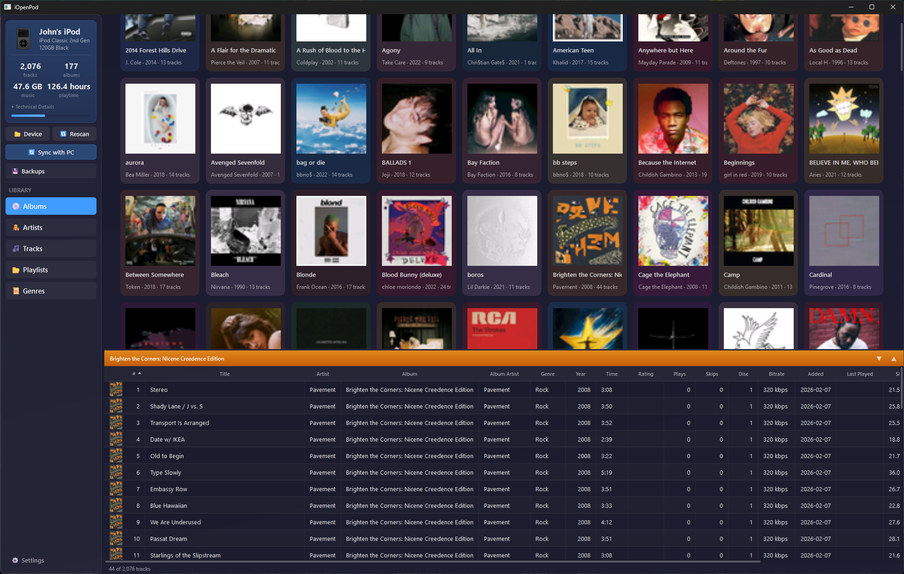
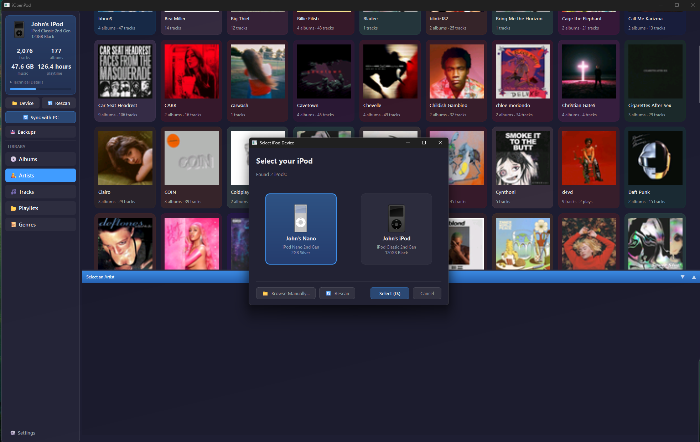
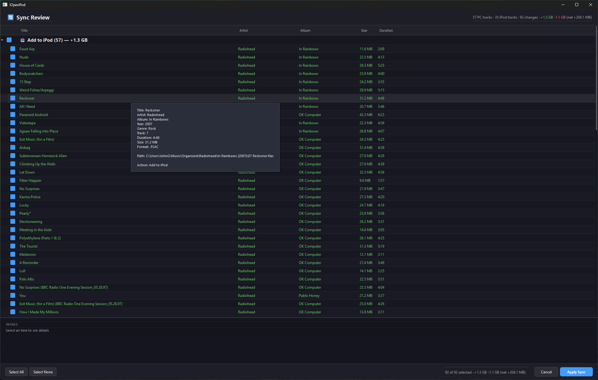
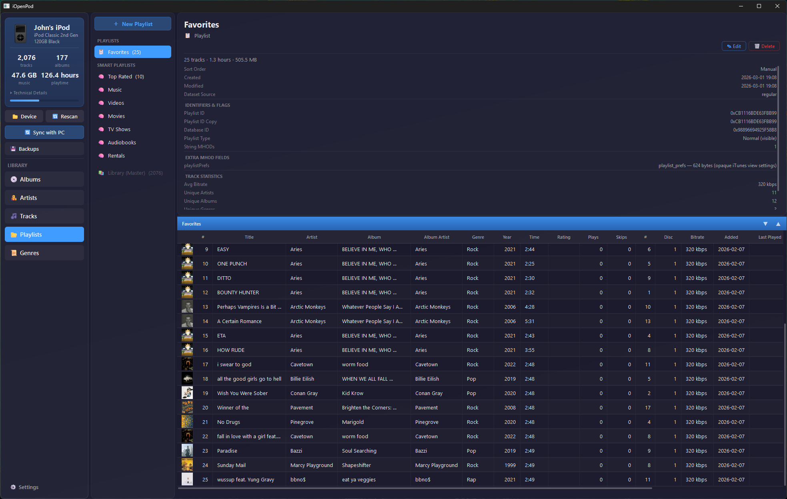
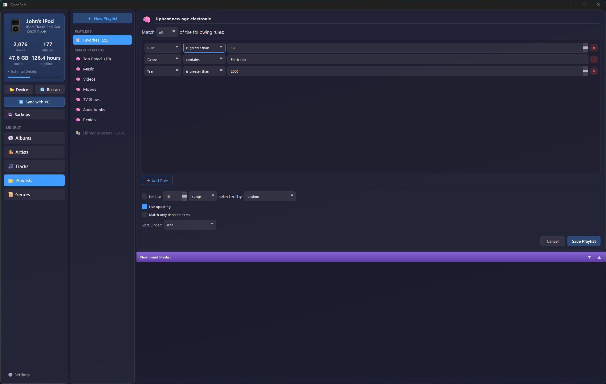
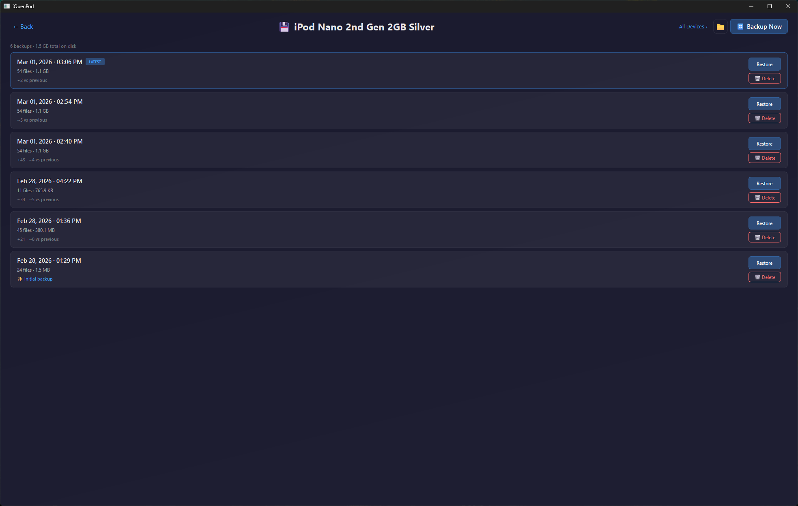
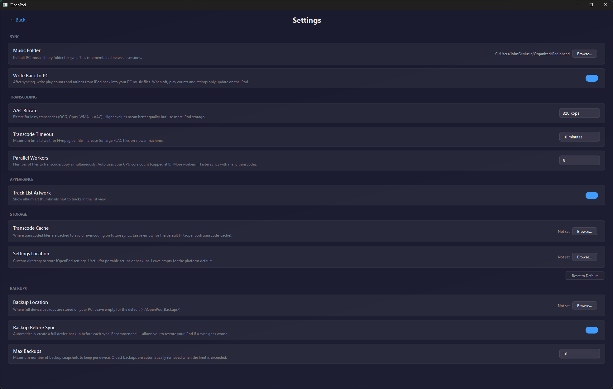

# iOpenPod

**Ditch iTunes. Sync your iPod the open way.**

[](LICENSE)
[](https://www.python.org/)
[](https://www.riverbankcomputing.com/software/pyqt/)

iOpenPod is a desktop app for managing iPod Classic and iPod Nano libraries. It speaks the iPod's native database format directly — no iTunes, no middleman. Plug in your iPod, point it at your music folder, and sync. FLAC, OGG, whatever — it handles the conversion.



---

## Get Started

You'll need **Python 3.13+** and **[uv](https://docs.astral.sh/uv/)**. For transcoding, install **[FFmpeg](https://ffmpeg.org/)**. For fingerprinting, install **[Chromaprint](https://acoustid.org/chromaprint)**.

```bash
git clone https://github.com/TheRealSavi/iOpenPod.git
cd iOpenPod
uv sync
uv run python main.py
```

Or with pip:

```bash
pip install -e .
python main.py
```

## How to Use

1. **Plug in your iPod** — it mounts as a regular drive
2. **Pick your device** — iOpenPod scans for connected iPods automatically
3. **Browse** — flip through albums, tracks, playlists, and artwork
4. **Sync** — choose your music folder, review what'll change, and hit go



---

## What It Does

**Sync music from any format.** Drop in FLAC, OGG, WMA, MP3, AAC — iOpenPod transcodes whatever the iPod can't play natively into ALAC or AAC. Converted files are cached so repeat syncs are fast.

**Keep play counts and ratings in sync.** When you listen on the iPod, those play counts and ratings come back to your PC library. You pick the conflict strategy — keep the higher count or the lower one.

**Album art just works.** Art gets extracted from your files, resized, and written in the iPod's RGB565 format. No extra steps.

**Review before you commit.** Every sync shows you exactly what's about to happen — new tracks, removals, metadata updates — with checkboxes for each item. Nothing changes until you say so.



**Playlists and smart playlists.** Browse and manage standard playlists. Smart playlists with rule-based filtering are supported too.




**Backups with one-click restore.** A snapshot of your iPod database is saved before every sync. If something goes wrong, roll back instantly.



**Configurable.** Tweak transcoding settings, sync behavior, and more from the settings page.



---

## Supported iPods

| Device | Read | Write | Notes |
|--------|------|-------|-------|
| iPod 1G–5G, Mini, Photo | ✅ | ✅ | No hash required |
| iPod Classic (all gens) | ✅ | ✅ | Uses FireWire ID from SysInfo |
| iPod Nano 1G–2G | ✅ | ✅ | No hash required |
| iPod Nano 3G–4G | ✅ | ✅ | Uses FireWire ID from SysInfo |
| iPod Nano 5G | ✅ | ✅ | Needs one iTunes sync for HashInfo |
| iPod Nano 6G–7G | ✅ | ❌ | Hash not reverse-engineered |

---

## For Contributors

### How Sync Works

The sync engine matches tracks between your PC and iPod using acoustic fingerprints ([Chromaprint](https://acoustid.org/chromaprint)). This means it can identify the same song even after re-encoding, format conversion, or metadata changes.

1. Scan both the PC music folder and iPod's iTunesDB
2. Compute or read cached fingerprints for each track
3. Diff by fingerprint to classify: new, removed, changed, or matched
4. Present the sync plan for review
5. Copy/transcode files, update the database, sync artwork and play counts
6. Rebuild the iTunesDB binary with the correct device-specific checksum

### Project Layout

```
iOpenPod/
├── GUI/                    # PyQt6 interface
│   ├── app.py              # Main window, device management
│   └── widgets/            # Album grid, track list, sidebar, sync review, etc.
├── iTunesDB_Parser/        # Reads iPod's binary iTunesDB
├── iTunesDB_Writer/        # Writes iTunesDB with hash/checksum support
├── ArtworkDB_Parser/       # Reads ArtworkDB binary format
├── ArtworkDB_Writer/       # Writes album art to .ithmb files
├── SyncEngine/             # Fingerprinting, diffing, transcoding, sync execution
└── main.py                 # Entry point
```

### Binary Format

Both database parsers (iTunesDB, ArtworkDB) use a recursive chunk-based architecture. Each chunk type (`mhbd`, `mhit`, `mhod`, etc.) has its own parser returning `{"nextOffset": int, "result": dict}`. The writer mirrors this structure, building chunks in a buffer and backpatching length fields.

Writing to newer iPods (Classic, Nano 3G+) requires computing a device-specific cryptographic hash. See the copilot instructions or `iTunesDB_Writer/hash58.py` for details.

### Areas Where Help Is Needed

- **Real hardware testing** — especially Nano 3G–5G models
- **macOS and Linux testing** — primary dev is on Windows
- **UI improvements** — dark theme polish, accessibility, new features
- **Bug reports** — open an issue with steps to reproduce

Open an issue before starting major changes so we can coordinate.

### Related Projects

- [libgpod](https://github.com/gtkpod/libgpod) — C library for iPod database access (the reference implementation this project learned from)
- [gtkpod](https://github.com/gtkpod/gtkpod) — GTK+ iPod manager
- [Rockbox](https://www.rockbox.org/) — Open-source firmware replacement for iPods

## License

MIT — see [LICENSE](LICENSE).
