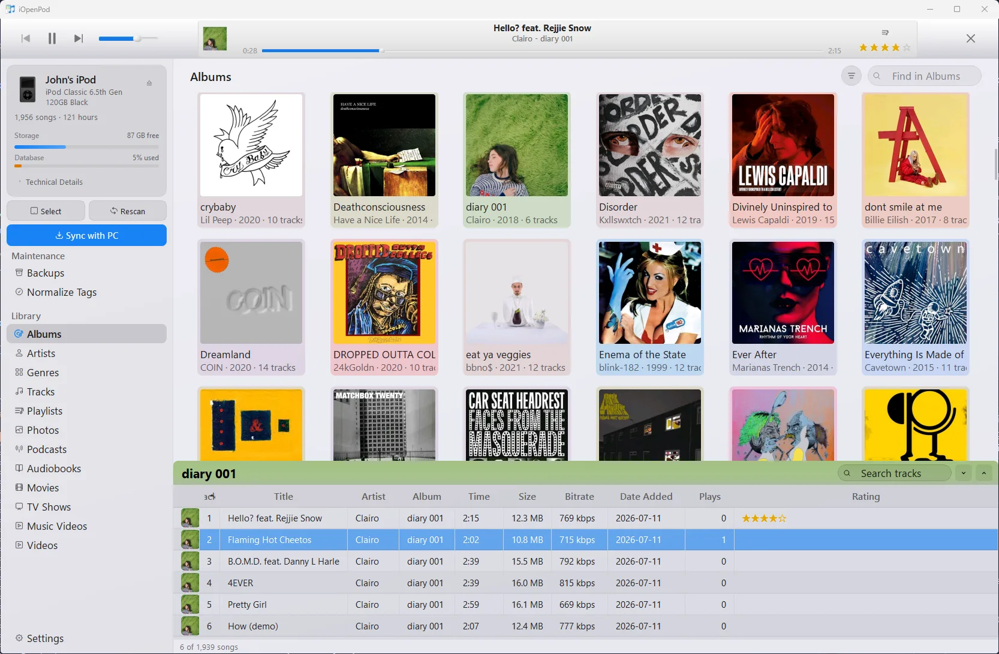
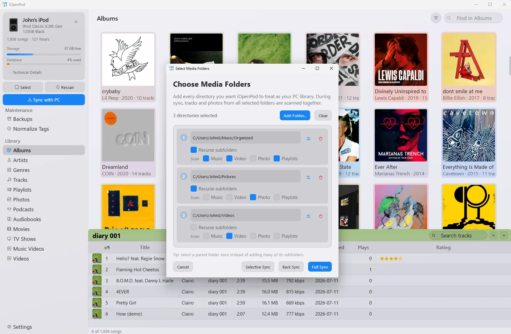
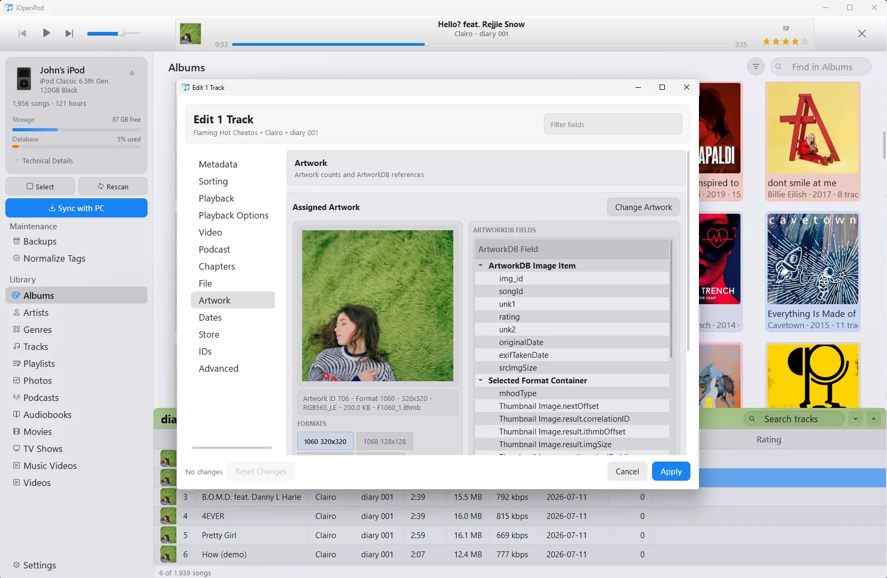
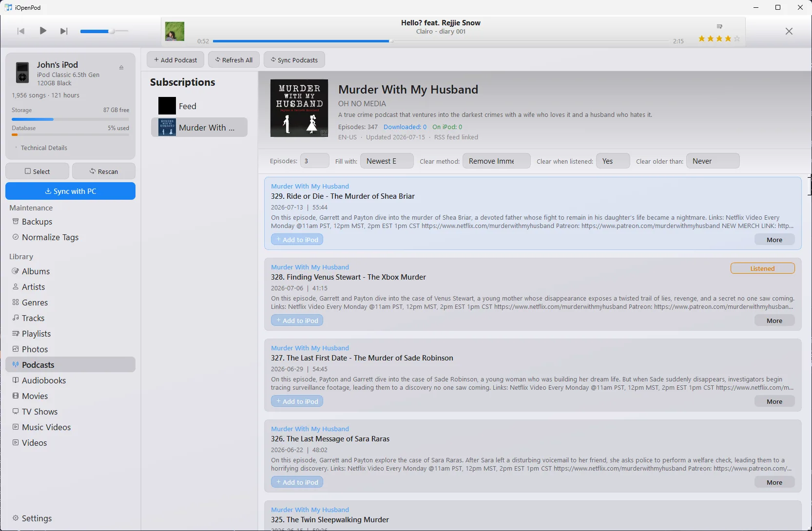
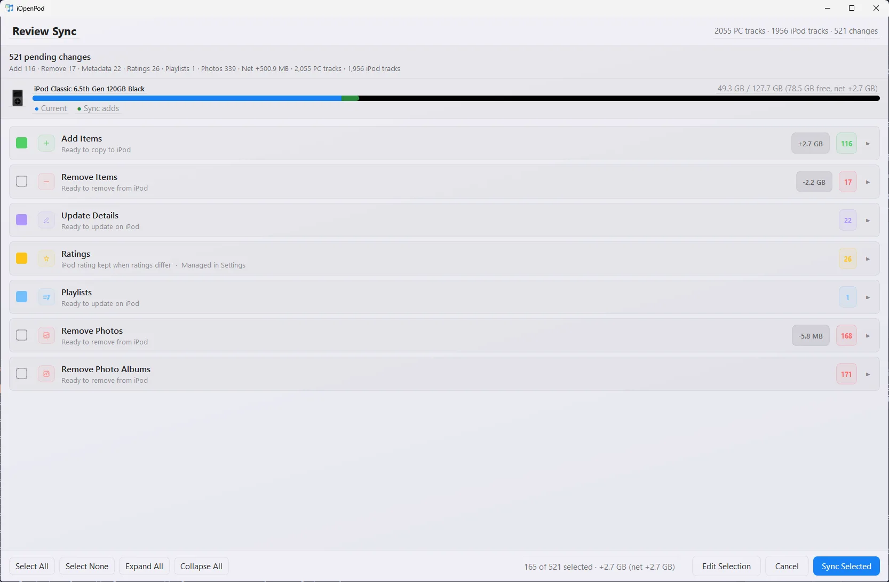
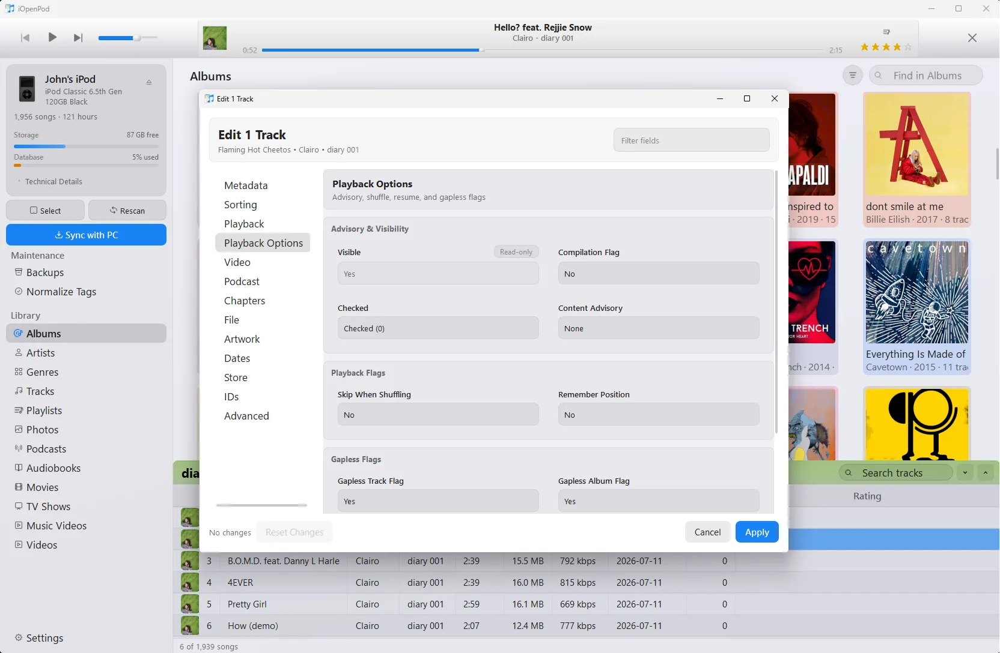
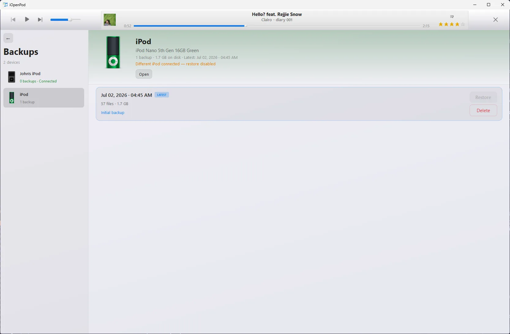
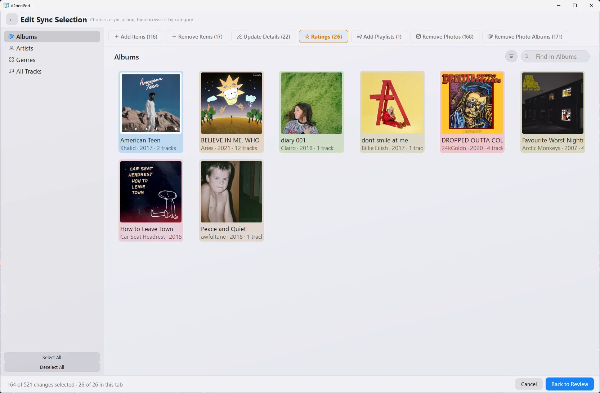
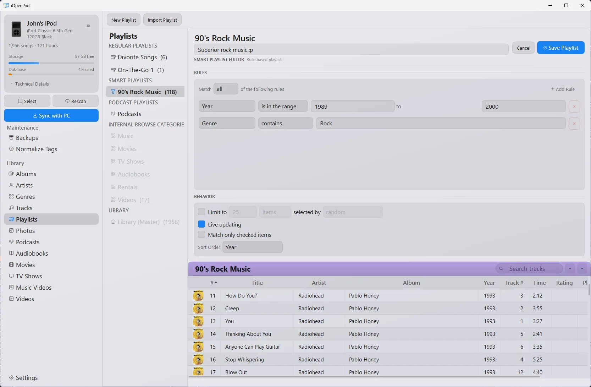
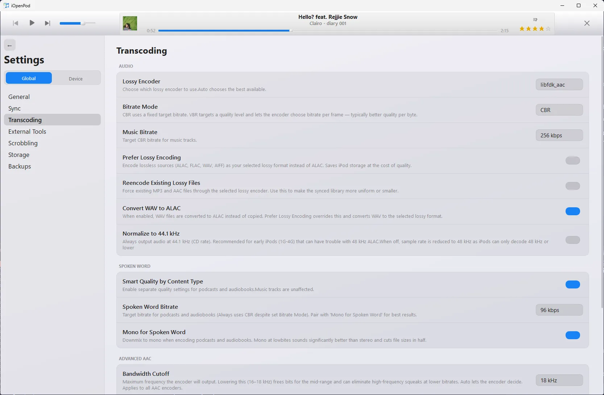

# iOpenPod: The Open-Source iPod Manager & iTunes Alternative for Windows, macOS, and Linux

**Sync, manage, and listen to your iPod**

[](LICENSE)
[](#download)
[](https://github.com/TheRealSavi/iOpenPod/releases/latest)
[](https://discord.gg/9Yy499Tf5d)
[](https://ko-fi.com/johngibbons)

iOpenPod is a free, cross-platform iPod manager and iTunes alternative for Linux, macOS, and Windows enabling FLAC to ALAC auto-conversion, iTunesDB metadata editing, and native podcast syncing. Built on Python and PyQt6, it allows you to browse and edit your iPod library, sync media from your PC, and seamlessly preserve iPod-specific database behaviors.



## Screenshots

| Sync Workflow | Library Editing | Device Tools |
| --- | --- | --- |
|  |  |  |
|  |  |  |
|  |  |  |

---

## Download and Install

Download the latest release for your platform. Native builds do not require any separate Python installation.

PyPI installs are recommended over native builds, but they all work the same.

### [Latest Native Release Builds](https://github.com/TheRealSavi/iOpenPod/releases/latest)

Need setup help? Use the [Install Help and Troubleshooting page](https://therealsavi.github.io/iOpenPod/install-help.html).

### Install from PyPI (Recommended)

iOpenPod is available through `pip`, `pipx`, and `uv tool`.

| Method | Install | Run | Upgrade |
| --- | --- | --- | --- |
| `pip` | `python -m pip install iopenpod` | `iopenpod` | `python -m pip install --upgrade iopenpod` |
| `pipx` | `pipx install iopenpod` | `iopenpod` | `pipx upgrade iopenpod` |
| `uv tool` | `uv tool install iopenpod` | `iopenpod` | `uv tool upgrade iopenpod` |

Requires **Python 3.11+**.

After installing, run:

```bash
iopenpod
```

If `iopenpod` is not on your PATH yet, run `pipx ensurepath` for `pipx` or `uv tool update-shell` for `uv tool`.

Update installs with the same tool you used to install them.

> **Required tools:** Install [FFmpeg](https://ffmpeg.org/) with `ffprobe` for transcoding and media probing, and [Chromaprint](https://acoustid.org/chromaprint) for acoustic fingerprinting during sync.
> **Linux desktop dependencies:** If iOpenPod throws a Qt `xcb` error or crashes when you press Ctrl, Alt, or Shift, install the XCB and XKeyboard packages listed on the [Install Help and Troubleshooting page](https://therealsavi.github.io/iOpenPod/install-help.html#helper-tools).
> **Linux iPod identification:** On first use, iOpenPod may ask you to run host-side udev setup commands. They publish only the Apple product serial and do not give the app raw-disk access. The iPod stays plugged in.

---

## How to Use

1. **Connect your iPod**. Make sure it is mounted as a drive.
2. **Select the device**. Pick the detected iPod in iOpenPod. If it shows up wrong, open an issue.
3. **Browse and edit**. Manage tracks, playlists, podcasts, artwork, and metadata.
4. **Sync**. Choose your media folders, review the changes, then apply.

---

## Core Features and Hardware Compatibility

iOpenPod supports the iPod Classic, iPod Mini, and iPod Nano from the 1st through 7th generations. Rockbox works when you enable the Rockbox compatibility settings.

### Automated FLAC Format Conversion and Transcoding

iOpenPod transcodes unsupported audio and video formats such as FLAC and OGG to iPod-compatible output with FFmpeg. Converted files can be cached so repeat syncs skip unchanged media.

### Managing Podcasts and Smart Playlists

The built-in podcast manager can search, subscribe, download episodes, and sync them to your iPod. You can also manage standard playlists and rule-based smart playlists.

### Acoustic Fingerprinting and Scrobbling

The sync engine matches tracks between your PC library and the iPod using acoustic fingerprints from Chromaprint. That keeps the same recording matched across re-encodes, format changes, and metadata edits. Play history can submit to ListenBrainz or Last.FM on sync.

### Drag and Drop

Files can be copied directly to the iPod by dragging them into the app, without using the full PC-folder sync workflow.

### Play Counts and Ratings

Play counts, ratings, and skip counts can be read from the iPod and synced back to the PC library metadata where supported.

### Embedded Album Artwork

Embedded or folder artwork is extracted, resized, and written to the iPod artwork database.

### Sync Review and Device Backups

Before writing changes, iOpenPod shows the planned additions, removals, metadata updates, and artwork changes. It also saves a device backup so you can roll back if needed.

### Customizable transcoding behavior

Settings are available for transcoding, allowing you to specifically decide the encoder and quality of encoding for audio files. The settings are adaptive, showing you only what is available and compatible with your current device, making this an easy process without any prior knowledge about iPod format compatibilities.  

---

## Supported iPods

iOpenPod supports most iPods. iPod Shuffle support is planned; iPod Touch support is not planned, but may be possible in the future.

| Device | Status | Notes |
| --- | --- | --- |
| iPod "Classic" (all generations 1st-7th) | Supported | |
| iPod Mini (all generations 1st and 2nd) | Supported | |
| iPod Nano (all generations 1st-7th) | Supported | |
| iPod Shuffle | Planned | Shuffle uses a different DB Structure. ETA ~4 mo |
| iPod Touch | Not planned | Touch requires accessing the device through non file-system protocols |

---

## For Contributing Developers

To run iOpenPod from source, clone the repository and use `uv sync`.

### Prerequisites

- **[uv](https://docs.astral.sh/uv/)** (Python package manager)
- **[FFmpeg](https://ffmpeg.org/)** with `ffprobe` (for transcoding and media probing)
- **[Chromaprint](https://acoustid.org/chromaprint)** (for fingerprinting)

### Setup

```bash
git clone https://github.com/TheRealSavi/iOpenPod.git
cd iOpenPod
uv sync
uv run iopenpod
```

`uv sync` installs dependencies into a local virtual environment.

### Dev checks

All lint, format, typecheck, and test commands go through one entry point:

```bash
uv run python scripts/dev.py check    # full gate
uv run python scripts/dev.py lint     # ruff
uv run python scripts/dev.py fmt      # ruff format
uv run python scripts/dev.py types    # mypy
uv run python scripts/dev.py test     # pytest
```

See `AGENTS.md` for the full command reference (including architecture checks and agent conventions).

Full human guide: [`docs/DEV.md`](docs/DEV.md).

### Contributing

Useful contributions include:

- Hardware testing on different iPod models
- macOS and Linux testing
- Bug reports with steps to reproduce and `iopenpod.log`
- Focused pull requests for documented issues
- Joining the discord to coordinate

To find logs in iOpenPod, open **Settings > Storage**, then click **Open** next to **Log Location**.

Please open an issue before starting major changes, or use the [Discord server](https://discord.gg/9Yy499Tf5d) to discuss implementation details.

### Related Projects

- [libgpod](https://github.com/gtkpod/libgpod) - C library for iPod database access (the reference implementation this project learned from)
- [gtkpod](https://github.com/gtkpod/gtkpod) - GTK+ iPod manager
- [Rockbox](https://www.rockbox.org/) - Open-source firmware replacement for iPods

---

## Star History
  <!-- markdownlint-disable MD033 -->

<a href="https://www.star-history.com/?repos=therealsavi%2Fiopenpod&type=timeline&legend=top-left">
 <picture>
   <source media="(prefers-color-scheme: dark)" srcset="https://api.star-history.com/chart?repos=therealsavi/iopenpod&type=timeline&theme=dark&legend=top-left&sealed_token=aMCIa4pbVoIhlxj9qK6fW6xT1G5WPmVyftpcUHMTDCF-jNcb-ZD5ewReZkCnZxjUqpEYILAoYH1UP1nYDNyqT1PbhUaA09JI1Lrq1EZ2-mO9bYPn3EWaHyBxmimY3pGYha3MHx1aNeAXRuF0UoijWcDkCgvNBHYDbZNCLG6zG8wx6tDuSh8cmrTN0uas" />
   <source media="(prefers-color-scheme: light)" srcset="https://api.star-history.com/chart?repos=therealsavi/iopenpod&type=timeline&legend=top-left&sealed_token=aMCIa4pbVoIhlxj9qK6fW6xT1G5WPmVyftpcUHMTDCF-jNcb-ZD5ewReZkCnZxjUqpEYILAoYH1UP1nYDNyqT1PbhUaA09JI1Lrq1EZ2-mO9bYPn3EWaHyBxmimY3pGYha3MHx1aNeAXRuF0UoijWcDkCgvNBHYDbZNCLG6zG8wx6tDuSh8cmrTN0uas" />
   
 </picture>
</a>

 <!-- markdownlint-enable MD033 -->
---

## Support

iOpenPod is free and open source. Donations are optional and help support development.

[](https://ko-fi.com/johngibbons)

## License

MIT. See [LICENSE](LICENSE).
