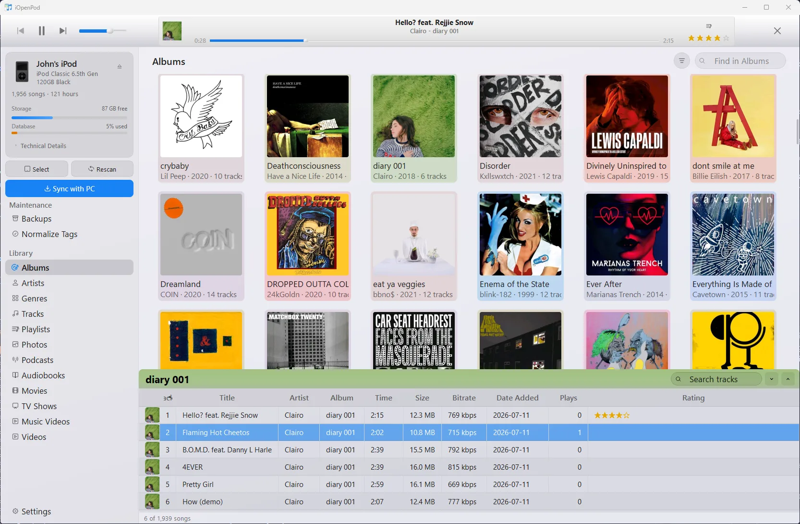
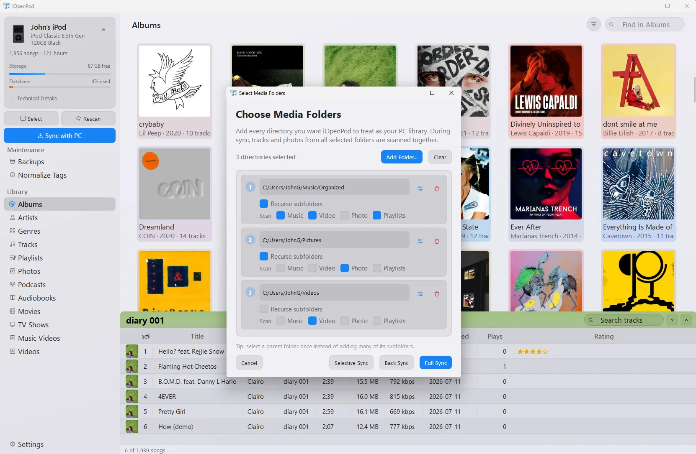
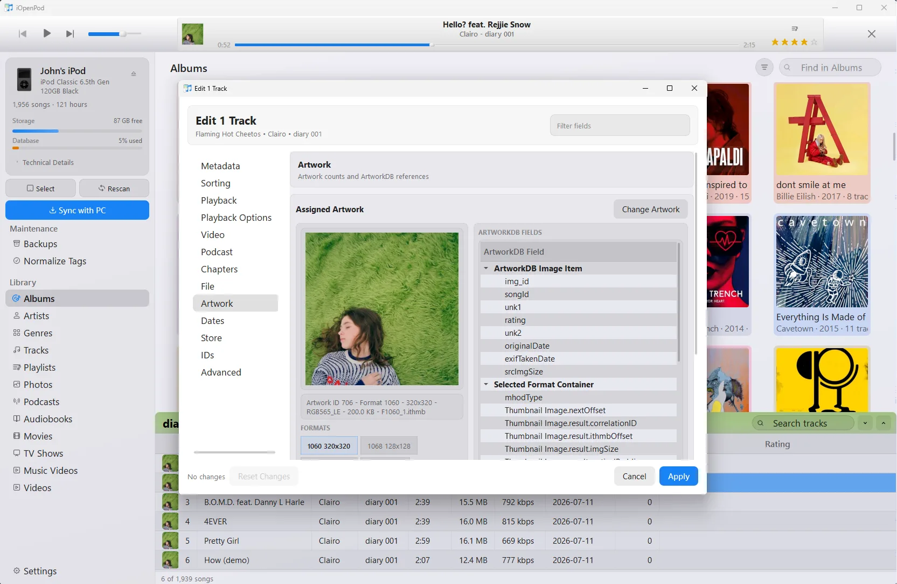
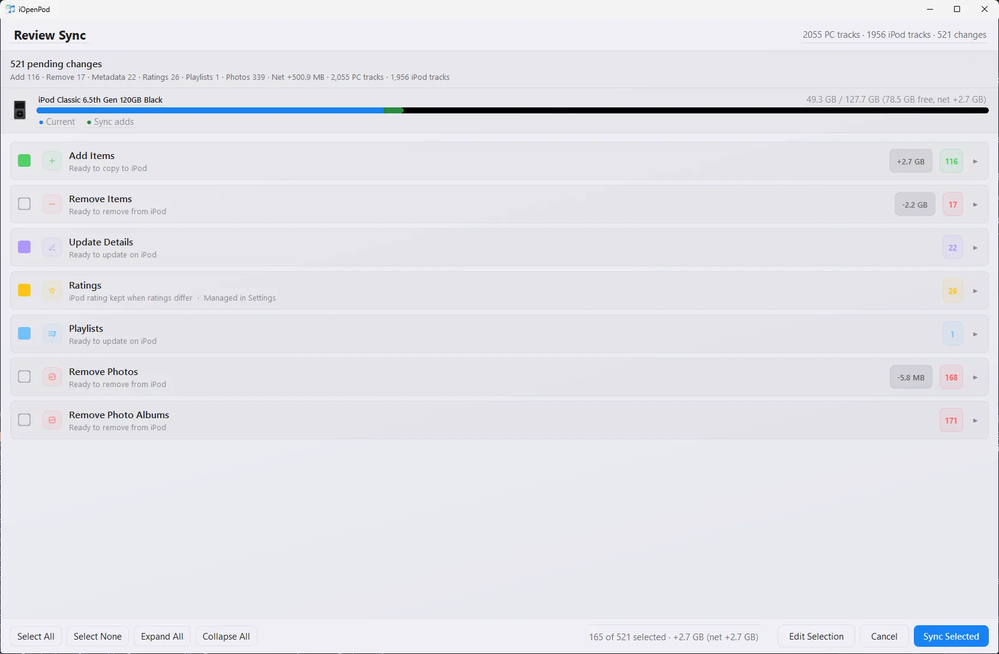
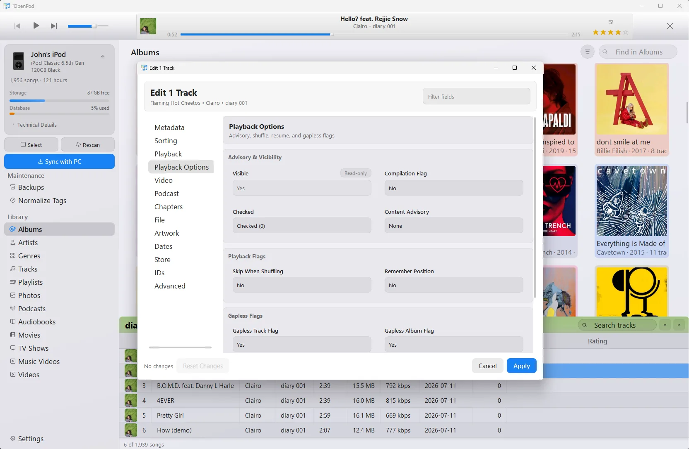
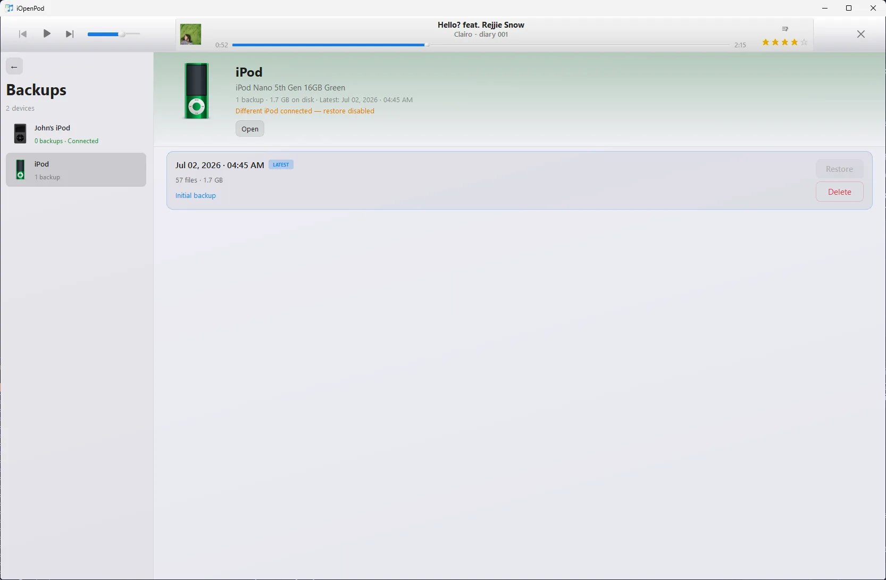
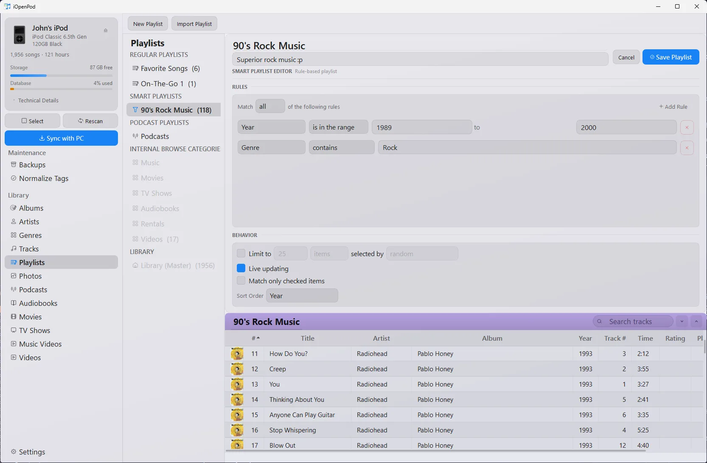
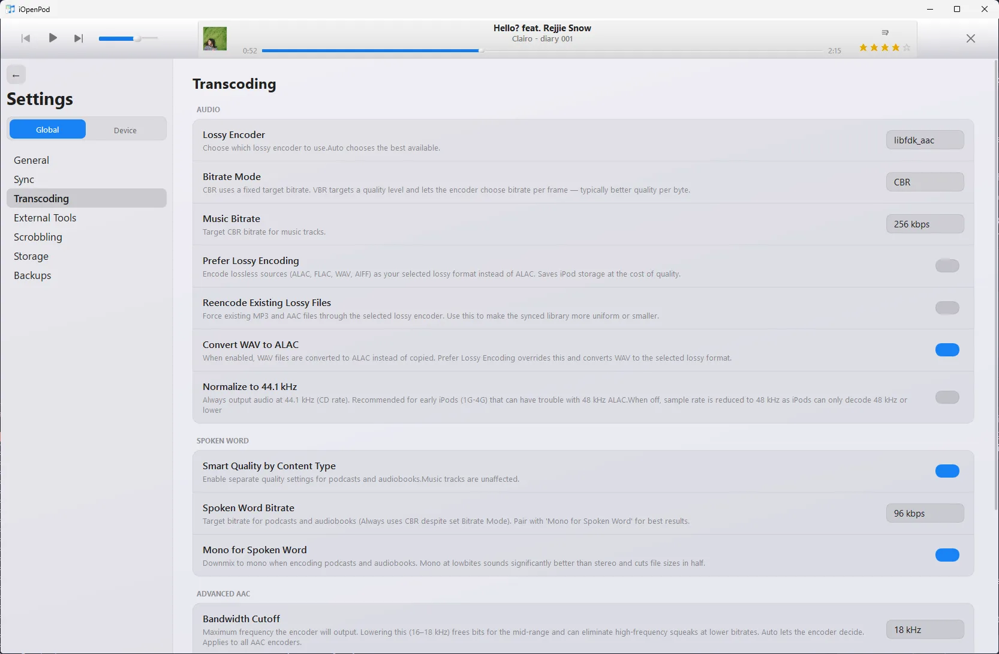

# iOpenPod

**A desktop iPod manager for Windows, macOS, and Linux.**

[](LICENSE)
[](#download)
[](https://github.com/TheRealSavi/iOpenPod/releases/latest)
[](https://discord.gg/9Yy499Tf5d)
[](https://ko-fi.com/johngibbons)

iOpenPod is a free, open-source desktop application for managing iPods without iTunes. It can browse and edit an iPod library, sync media from the PC, convert unsupported audio and video formats automatically, manage podcasts and playlists, write artwork and photos, and is built to preserve iPod-specific database behaviors.



## Screenshots

| Sync Workflow | Library Editing | Device Tools |
| --- | --- | --- |
|  |  |  |
|  |  |  |
|  |  |  |

---

## Download

iOpenPod is not yet released on the Mac App Store, Microsoft Store,
Flathub, or Snap Store. The links below refer to **Original iOpenPod** releases.

### [Latest Release Builds](https://github.com/TheRealSavi/iOpenPod/releases/latest)

Need step-by-step, platform-specific setup help? See the [Install Help and Troubleshooting page](https://therealsavi.github.io/iOpenPod/install-help.html).

### Install from PyPI (Recommended)

iOpenPod is available as a Python package to download through `pip`, `pipx`, and `uv tool`.

| Method | Install | Run | Upgrade |
| --- | --- | --- | --- |
| `pip` | `python -m pip install iopenpod` | `iopenpod` | `python -m pip install --upgrade iopenpod` |
| `pipx` | `pipx install iopenpod` | `iopenpod` | `pipx upgrade iopenpod` |
| `uv tool` | `uv tool install iopenpod` | `iopenpod` | `uv tool upgrade iopenpod` |

Requires **Python 3.12**.

After installing invoke in your shell with:

```bash
iopenpod
```

If `iopenpod` is not on your shell `PATH` yet, run `pipx ensurepath` for `pipx` installs or `uv tool update-shell` for `uv tool` installs.

Installs should be updated with the same tool used to install them.

> **Required tools:** Install [FFmpeg](https://ffmpeg.org/) with `ffprobe` for transcoding and media probing, and [Chromaprint](https://acoustid.org/chromaprint) for acoustic fingerprinting during sync.
> **Linux desktop dependencies:** If iOpenPod fails with a Qt `xcb` platform plugin error or crashes when pressing Ctrl, Alt, or Shift, install the XCB/XKeyboard runtime packages listed on the [Install Help and Troubleshooting page](https://therealsavi.github.io/iOpenPod/install-help.html#helper-tools).
> **Linux iPod identification:** On first use, iOpenPod may ask you to copy
> and run transparent host-side udev setup commands. This publishes only the
> Apple product serial and never grants the app raw-disk access. The setup
> uses a targeted udev refresh, so the iPod does not need to be disconnected.

---

## How to Use

1. **Connect your iPod** - Make sure it is mounted as a drive.
2. **Select the device** - Choose the detected iPod in iOpenPod. If the device is detected incorrectly, please open an issue.
3. **Browse and edit** - Manage tracks, playlists, podcasts, artwork, and metadata.
4. **Sync** - Choose PC media folder(s), configure the sync, review the proposed changes, then apply.

---

## Features

The Original iOpenPod provides the behavioral baseline for these features. iOpenPod
2.0 is being rebuilt incrementally until it reaches and then surpasses that baseline;
an incomplete development build does not imply that a missing feature has been
removed from the product target.

### Format Conversion

iOpenPod transcodes unsupported audio and video formats to iPod-compatible output using FFmpeg. `ffprobe` is needed to detect incompatible formats. Converted files are optionally cached so repeat syncs do not need to re-encode unchanged media.

### Podcasts

The built-in podcast manager can search, subscribe, download episodes, and sync them to an iPod.

### Scrobbling

ListenBrainz and Last.FM scrobbling can submit play history during sync.

### Media Types

Supports music, audiobooks, podcasts, videos, and photos.

### Drag and Drop

Files can be copied directly to the iPod by dragging them into the app, without using the full PC-folder sync workflow.

### Play Counts and Ratings

Play counts, ratings, and skip counts can be read from the iPod and synced back to the PC library metadata where supported.

### Artwork

Embedded or folder artwork is extracted, resized, and written to the iPod artwork database.

### Sync Review

Before writing changes, iOpenPod presents a review of planned additions, removals, metadata updates, and artwork changes.

### Playlists and Smart Playlists

Standard playlists and rule-based smart playlists can be browsed and managed.

### Backup and Restore

iOpenPod provides an independent Backup Snapshot and restore workflow. The Backups
page can capture, browse, annotate, export, restore, and safely delete iOpenPod backup
format v4 archives. A read-only Legacy Backup Import verifies and converts Original
iOpenPod backup formats v2 and v3 to v4 without modifying their source. Restore uses a
durable journal and an automatic Host safety snapshot so an interrupted operation can
be diagnosed and recovered explicitly. Until that recovery is verified, the Backups
page keeps a recovery action visible and blocks another destructive restore.

### Settings

Settings are available for transcoding, sync behavior, external tools, device handling, and related workflows.

---

## Supported iPods

iOpenPod 2.0 targets the filesystem-accessible iPod families supported by the
Original iOpenPod on Windows, macOS, and Linux. iPod shuffle and iPod touch are
outside the 2.0 release target.

| Device | Status | Notes |
| --- | --- | --- |
| iPod "Classic" (all generations 1st-7th) | Supported | |
| iPod Mini (all generations 1st and 2nd) | Supported | |
| iPod Nano (all generations 1st-7th) | Supported | |
| iPod Shuffle | Outside target | Shuffle uses a different database structure |
| iPod Touch | Outside target | Touch requires non-filesystem device protocols |

---

## For Contributing Developers

The iOpenPod 2.0 development environment is managed entirely through UV.

### Prerequisites

- **[uv](https://docs.astral.sh/uv/)** (Python package manager)
- **[FFmpeg](https://ffmpeg.org/)** with `ffprobe` (for transcoding and media probing)
- **[Chromaprint](https://acoustid.org/chromaprint)** (for fingerprinting)

### Setup

```bash
uv sync --locked
```

UV selects Python 3.12 from `.python-version` and installs the locked runtime and
development dependencies into `.venv`.

Launch the app with `uv run iopenpod` or `uv run python -m iOpenPod`.
Native packaging and store release requirements are documented in
[`docs/packaging.md`](docs/packaging.md).

### Dev checks

Run development tools through the locked UV environment:

```bash
uv lock --check
uv run ruff format --check .
uv run ruff check .
uv run rumdl check .
uv run mypy
uv run pytest
```

The settings for Ruff, Mypy, Pytest, and Rumdl live in `pyproject.toml`. VS Code uses
those same settings and exposes the same commands through the `Check: All` task.
Portable editor behavior lives in `.editorconfig`, Git line endings are normalized
by `.gitattributes`, and workspace integration lives in `.vscode/`.

The Pytest suite protects the definition-driven, lossless iTunesDB, ArtworkDB, and
PhotosDB parser/writer foundations. Test code is included in the normal Mypy check.

See [`AGENTS.md`](AGENTS.md) for working agreements and [`docs/README.md`](docs/README.md)
for the project knowledge map.

### Project Layout

```text
iOpenPod/
├── src/
│   ├── device_registry/            # iPod identity and capabilities
│   ├── iOpenPod/                   # Application orchestration and GUI
│   ├── iPodDB/                     # iPod database formats
│   └── storage/                    # Safe removable-media infrastructure
├── tests/
├── docs/
│   ├── adr/
│   ├── agents/
│   └── source_architecture.md
├── AGENTS.md
├── CONTEXT.md
├── GLOSSARY.md
└── pyproject.toml
```

These are internal packages in one iOpenPod application and distribution; they are
not released or versioned separately. Branded package names retain the established
capitalization of iOpenPod and iPodDB. See
[`docs/source_architecture.md`](docs/source_architecture.md) for the target design and
the ADRs for accepted decisions.

### How Sync Works

The sync engine matches tracks between the PC library and iPod using acoustic fingerprints from [Chromaprint](https://acoustid.org/chromaprint). This allows the same recording to be matched across re-encodes, format changes, and metadata edits.

1. Scan both the PC media folder and iPod's iTunesDB
2. Compute or read cached fingerprints for each track
3. Diff by fingerprint to classify: new, removed, changed, or matched
4. Present the sync plan for review
5. Copy/transcode files, update the database, sync artwork and play counts
6. Rebuild the iTunesDB binary with the correct device-specific checksum

### Contributing

Useful contributions include:

- Hardware testing on different iPod models
- macOS and Linux testing
- Bug reports with steps to reproduce and `iopenpod.log`
- Focused pull requests for documented issues
- Joining the discord to coordinate

To find logs in iOpenPod, open **Settings > Storage**, then click **Open** next to **Log Location**.

Please open an issue before starting major changes, or use the [Discord server](https://discord.gg/9Yy499Tf5d) to discuss implementation details.

### Acknowledgements

Special thanks to [Dylan Staley (@dstaley)](https://github.com/dstaley) for the
[HASHAB WebAssembly implementation](https://github.com/dstaley/hashab) used by
iOpenPod, and an honorary thank-you to the **libgpod** and **gtkpod** contributors
for their pioneering iPod support and the references this project learned from.
See [ACKNOWLEDGEMENTS.md](ACKNOWLEDGEMENTS.md) for the credits included with the app.

### Related Projects

- [libgpod](https://github.com/gtkpod/libgpod) — C library for iPod database access (the reference implementation this project learned from)
- [gtkpod](https://github.com/gtkpod/gtkpod) — GTK+ iPod manager
- [Rockbox](https://www.rockbox.org/) — Open-source firmware replacement for iPods

---

## Star History
  <!-- markdownlint-disable MD033 -->

<a href="https://www.star-history.com/?repos=therealsavi%2Fiopenpod&type=timeline&legend=top-left">
 <picture>
   <source media="(prefers-color-scheme: dark)" srcset="https://api.star-history.com/chart?repos=therealsavi/iopenpod&type=timeline&theme=dark&legend=top-left&sealed_token=aMCIa4pbVoIhlxj9qK6fW6xT1G5WPmVyftpcUHMTDCF-jNcb-ZD5ewReZkCnZxjUqpEYILAoYH1UP1nYDNyqT1PbhUaA09JI1Lrq1EZ2-mO9bYPn3EWaHyBxmimY3pGYha3MHx1aNeAXRuF0UoijWcDkCgvNBHYDbZNCLG6zG8wx6tDuSh8cmrTN0uas" />
   <source media="(prefers-color-scheme: light)" srcset="https://api.star-history.com/chart?repos=therealsavi/iopenpod&type=timeline&legend=top-left&sealed_token=aMCIa4pbVoIhlxj9qK6fW6xT1G5WPmVyftpcUHMTDCF-jNcb-ZD5ewReZkCnZxjUqpEYILAoYH1UP1nYDNyqT1PbhUaA09JI1Lrq1EZ2-mO9bYPn3EWaHyBxmimY3pGYha3MHx1aNeAXRuF0UoijWcDkCgvNBHYDbZNCLG6zG8wx6tDuSh8cmrTN0uas" />
   
 </picture>
</a>

 <!-- markdownlint-enable MD033 -->
---

## Support

iOpenPod is free and open source. Donations are optional and help support development.

[](https://ko-fi.com/johngibbons)

## License

iOpenPod is licensed under **GPL-3.0-or-later**. It is free to use and distribute,
and donations are optional. Distribution requires preserving the license notices
and providing corresponding source under the applicable licenses.

See [COPYING.md](COPYING.md) for the license grant and retained attribution,
[LICENSE](LICENSE) for the full GPL text, and the
[distribution licensing guide](docs/licensing.md) for release obligations.
Third-party components retain their own licenses.
