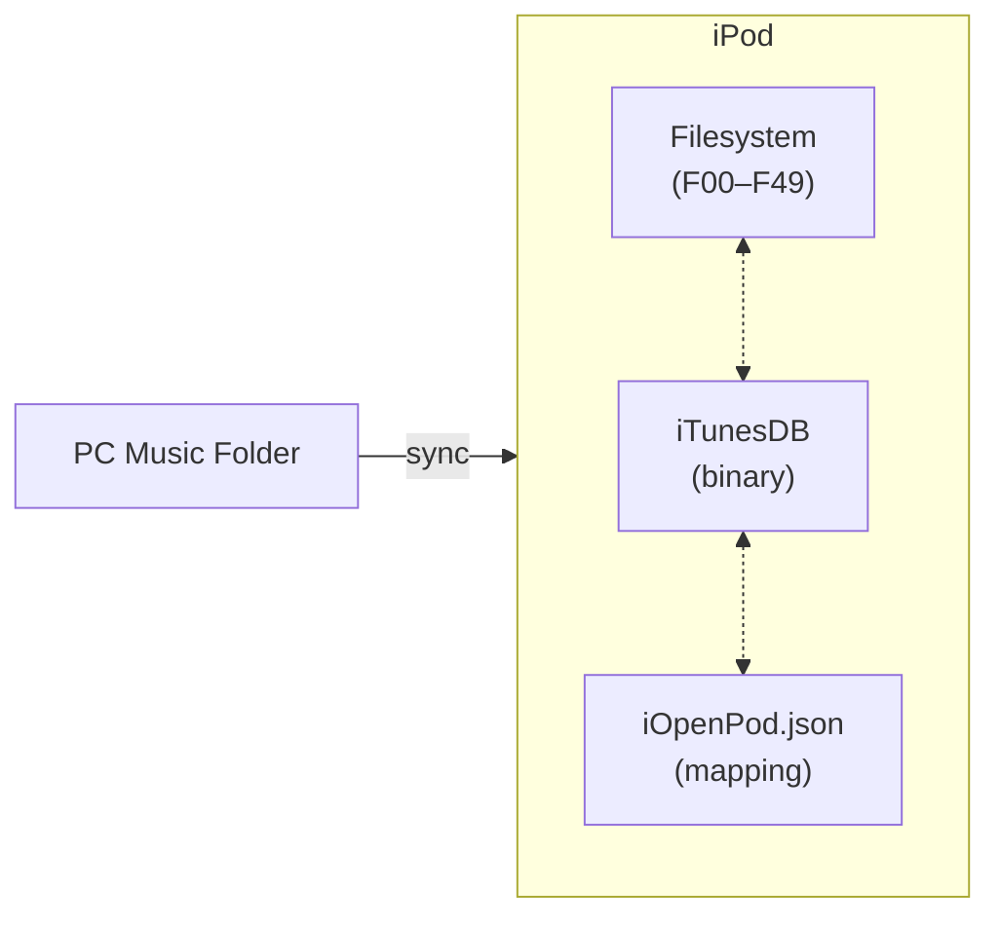
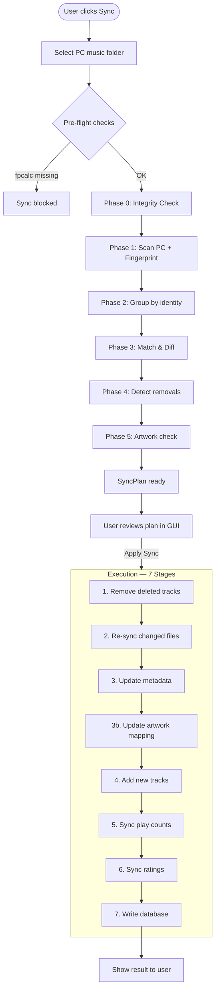
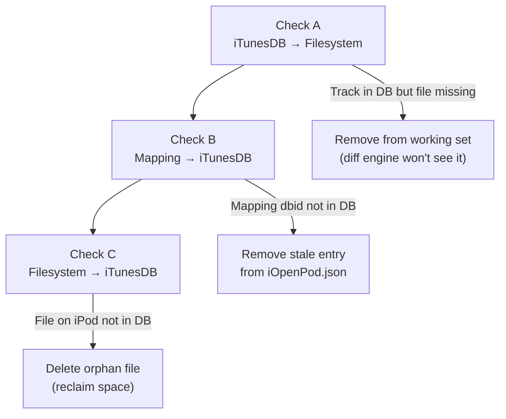
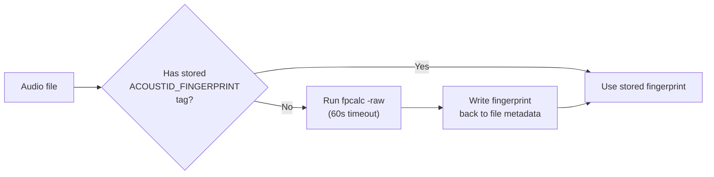
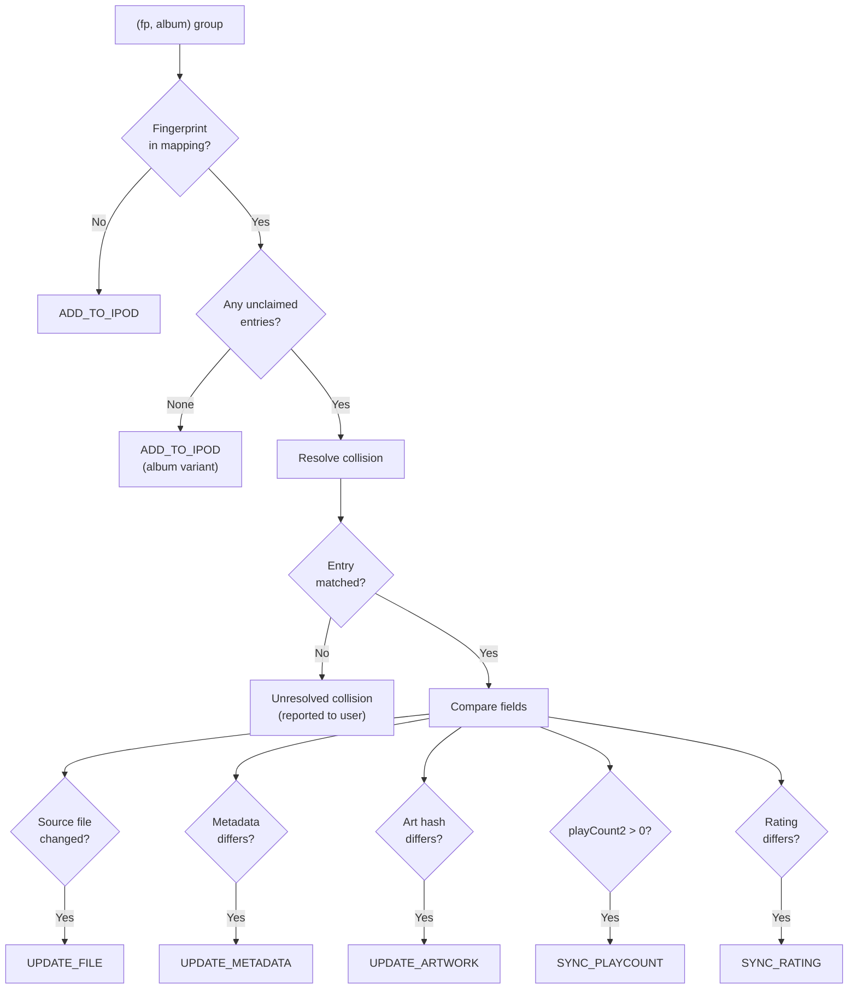
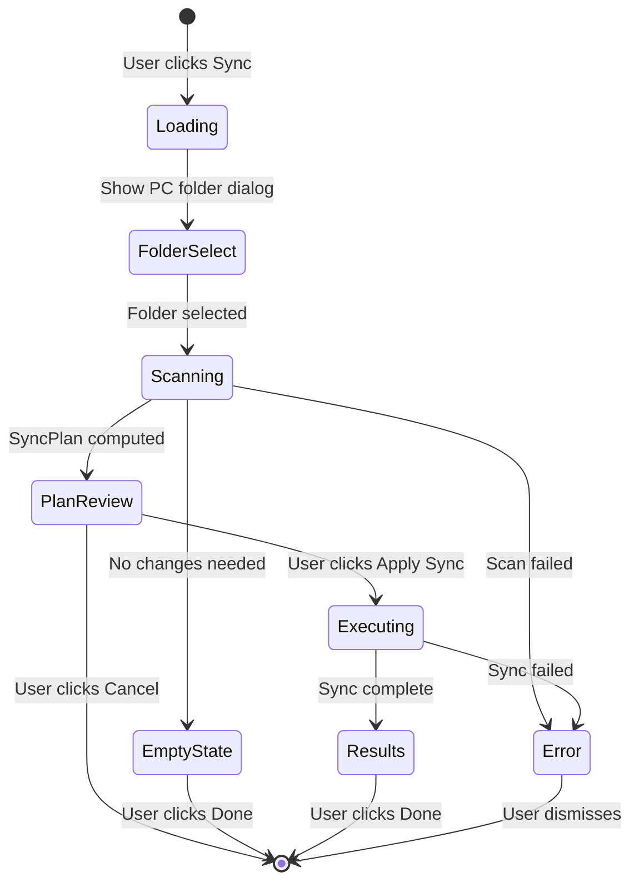
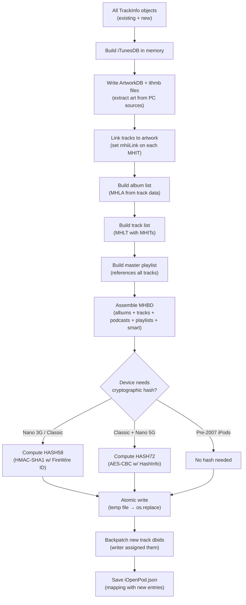
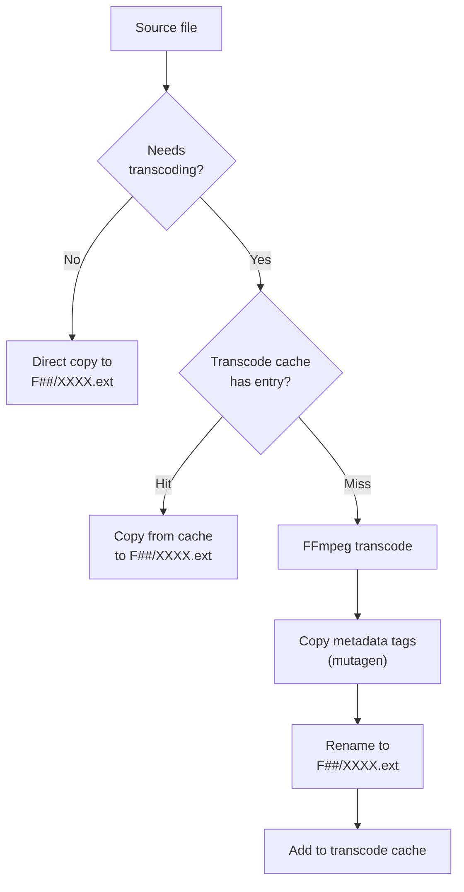
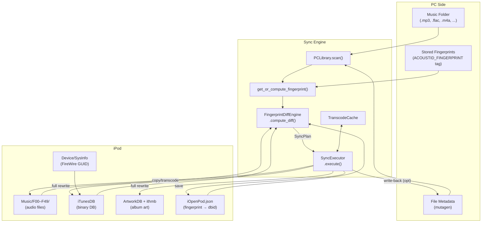

# iOpenPod Sync — How It Works

Complete reference for the sync system that bridges a PC music library to an iPod Classic.

---

## Overview

The sync system mirrors a folder of music files on a PC to an iPod Classic. It uses **acoustic fingerprinting** (Chromaprint) to track identity — not filenames or metadata — so renaming files, re-tagging, or upgrading quality never confuses the sync.

Three sources of truth are kept consistent:

| Source | Location | Purpose |
|--------|----------|---------|
| **Filesystem** | `/iPod_Control/Music/F00–F49/` | Actual audio files on iPod |
| **iTunesDB** | `/iPod_Control/iTunes/iTunesDB` | Binary database the iPod firmware reads |
| **iOpenPod.json** | `/iPod_Control/iTunes/iOpenPod.json` | Our mapping file (`fingerprint → dbid`) |



---

## External Dependencies

| Tool | Purpose | Required? |
|------|---------|-----------|
| **fpcalc** (Chromaprint) | Compute acoustic fingerprints | Yes — sync cannot start without it |
| **ffmpeg** | Transcode FLAC/OGG/etc. to iPod-compatible formats | Optional — only MP3/M4A work without it |
| **mutagen** | Read/write audio metadata (tags) | Yes (Python package) |

The GUI checks for both tools at sync start. Missing `fpcalc` blocks the sync entirely; missing `ffmpeg` shows a warning but allows continuing with native formats only.

---

## Identity Model

> **Identity = `(acoustic_fingerprint, album)`**

Two tracks are the "same" if and only if they share the same fingerprint AND the same album name (case-insensitive).

| Scenario | Same FP? | Same Album? | Result |
|----------|----------|-------------|--------|
| Same file, re-tagged | Yes | Yes | Matched — metadata update only |
| Same song on original album + Greatest Hits | Yes | No | Two separate iPod tracks |
| Different song, same album | No | — | Two separate iPod tracks |
| Same file in two PC folders, same album | Yes | Yes | **True duplicate** — one is synced, extra reported |

This prevents the "greatest hits problem" where the same recording appears on multiple albums.

---

## Sync Pipeline — End to End



---

## Phase 0 — Integrity Check

Before computing any diffs, the integrity checker validates consistency between the three sources. It runs three checks and repairs discrepancies automatically.



### Check A: DB → Filesystem

For every track in iTunesDB with a `Location` field, verify the audio file exists on disk. If missing, the track is removed from the in-memory working set so the diff engine doesn't think it's still on the iPod.

### Check B: Mapping → iTunesDB

For every `dbid` in iOpenPod.json, verify it exists in the (already-cleaned) track list. Stale entries are removed from the mapping. If any stale entries are found, the cleaned mapping is saved immediately.

### Check C: Filesystem → iTunesDB (Orphan Detection)

Scan `/iPod_Control/Music/F**/` for audio files not referenced by any iTunesDB track. Orphans are deleted to reclaim space. Only actual audio extensions are considered (`.mp3`, `.m4a`, `.m4b`, `.m4p`, `.mp4`, `.aac`, `.wav`, `.aif`, `.aiff`, `.alac`).

The integrity report is stored on the `SyncPlan` and displayed in the GUI as a non-actionable informational section.

---

## Phase 1 — PC Scan & Fingerprinting

The `PCLibrary` class walks the user's chosen music folder recursively, reading metadata from every audio file via mutagen.

### Supported Formats

| Format | Extensions | Native to iPod? |
|--------|-----------|-----------------|
| MP3 | `.mp3` | Yes — direct copy |
| AAC/M4A | `.m4a`, `.aac` | Yes — direct copy |
| FLAC | `.flac` | No → transcode to ALAC |
| WAV | `.wav` | No → transcode to ALAC |
| AIFF | `.aif`, `.aiff` | No → transcode to ALAC |
| OGG Vorbis | `.ogg` | No → transcode to AAC |
| Opus | `.opus` | No → transcode to AAC |
| WMA | `.wma` | No → transcode to AAC |

### Metadata Extracted

Title, artist, album, album artist, genre, year, track/disc numbers, duration, bitrate, sample rate, rating, sort tags (sort artist/title/album), compilation flag, and **art hash** (MD5 of embedded image bytes for artwork change detection).

### Fingerprinting

For each file, the engine calls `get_or_compute_fingerprint()`:



Fingerprints are stored in file metadata to avoid recomputation:

| Format | Tag Location |
|--------|-------------|
| MP3 | `TXXX:ACOUSTID_FINGERPRINT` (ID3v2) |
| M4A/AAC | `----:com.apple.iTunes:ACOUSTID_FINGERPRINT` |
| FLAC/OGG | `ACOUSTID_FINGERPRINT` (Vorbis comment) |

Files that fail fingerprinting are recorded in `fingerprint_errors` and reported in the GUI as a non-blocking warning section.

---

## Phase 2 — Group by Identity

PC tracks are grouped by `(fingerprint, album_key)` where `album_key` is the lowercased, stripped album name.

If multiple files share the same fingerprint AND same album, they are **true duplicates**. Only the first file is synced; extras are reported to the user as duplicates with file paths shown.

If the same fingerprint appears with different albums, each album group is treated as an independent track (the greatest hits case).

---

## Phase 3 — Match & Diff

Each identity group is compared against the mapping file to determine what action is needed.



### Collision Resolution

When a fingerprint has multiple mapping entries (same song on multiple albums), the engine disambiguates:

1. **Single entry** → trivial match
2. **`source_path_hint` matches** → the mapping entry whose stored relative path matches the current PC file's relative path wins
3. **No match** → unresolved collision, surfaced to the user

### Change Detection Details

| Check | Method | Triggers |
|-------|--------|----------|
| **File changed** | `size + mtime` gate: size diff > 1% AND > 10 KB, or mtime changed AND size changed | `UPDATE_FILE` — re-copy/transcode |
| **Metadata changed** | Compare 8 fields: title, artist, album, album_artist, genre, year, track_number, disc_number | `UPDATE_METADATA` — update TrackInfo |
| **Artwork changed** | Compare `art_hash` (MD5 of embedded image bytes) vs mapping's stored hash | `UPDATE_ARTWORK` — mapping update + full ArtworkDB rewrite |
| **Play count** | `playCount2 > 0` in iTunesDB (iPod increments this between syncs) | `SYNC_PLAYCOUNT` — additive write-back |
| **Rating** | iPod rating ≠ PC rating, either non-zero | `SYNC_RATING` — last-write-wins (iPod preferred) |

### Metadata Fields Compared

| PC Field | iPod Track Key |
|----------|---------------|
| `title` | `Title` |
| `artist` | `Artist` |
| `album` | `Album` |
| `album_artist` | `Album Artist` |
| `genre` | `Genre` |
| `year` | `year` |
| `track_number` | `trackNumber` |
| `disc_number` | `discNumber` |

---

## Phase 4 — Detect Removals

Two sources of removals:

1. **Fingerprints entirely absent from PC** — every mapping entry for that fingerprint becomes a `REMOVE_FROM_IPOD` action.
2. **Unclaimed mapping entries** — fingerprint still exists on PC but some mapping entries weren't claimed by any identity group (e.g., a song was removed from Greatest Hits but kept on the original album).

Stale mapping entries (dbid in mapping but not in iTunesDB) are silently cleaned and not shown to the user.

---

## Phase 5 — Missing Artwork Check

For every matched track, if the iPod track has `artworkCount == 0` or `mhiiLink == 0`, it's counted as missing artwork. The `artwork_needs_sync` flag triggers a full ArtworkDB rewrite during execution, which re-extracts art from all PC source files.

---

## The Sync Plan

The diff engine produces a `SyncPlan` containing all categorized actions:

| Category | Action | Color in GUI |
|----------|--------|-------------|
| Add to iPod | `ADD_TO_IPOD` | Green |
| Remove from iPod | `REMOVE_FROM_IPOD` | Red |
| Re-sync Changed Files | `UPDATE_FILE` | Cyan |
| Update Metadata | `UPDATE_METADATA` | Purple |
| Update Artwork | `UPDATE_ARTWORK` | Magenta/Green/Red (by type) |
| Sync Play Counts | `SYNC_PLAYCOUNT` | Blue |
| Sync Ratings | `SYNC_RATING` | Gold |

Additional informational sections (no checkboxes):
- **Integrity Fixes** — auto-repaired issues from Phase 0
- **Fingerprint Errors** — files that couldn't be fingerprinted
- **Duplicates** — true duplicate groups showing all file paths
- **Sync Album Art** — tracks missing artwork on iPod

The plan also includes a `StorageSummary` with bytes to add/remove/update and net change.

---

## User Review (GUI)



### Loading State

Shows a progress bar with friendly stage labels:

| Internal Stage | Displayed As |
|---------------|-------------|
| `load_mapping` | Loading iPod mapping |
| `integrity` | Checking iPod integrity |
| `scan_pc` | Scanning PC library |
| `fingerprint` | Computing fingerprints |
| `diff` | Comparing libraries |

### Plan Review State

A tree view groups actions by category. Each action item has:
- **Checkbox** — include/exclude from sync (Select All / Select None buttons available)
- **Title, Artist, Album** columns
- **Size** or field-specific info (changed fields for metadata, play delta for play counts, star display for ratings)
- **Duration**
- **Tooltip** — full track metadata and action explanation

The header shows summary stats: PC track count, iPod track count, total changes, and a git-diff style size delta (`+120.5 MB -45.2 MB (net +75.3 MB)`).

### Executing State

Shows progress through the 7 execution stages with a progress bar. The cancel button sends an interruption request checked between each item.

### Results State

Shows success/failure icon, summary of what was done (tracks added, removed, updated, etc.), and any errors.

---

## Execution — The 7 Stages

All stages run sequentially. Each checks for cancellation between items. The database is NOT written incrementally — all mutations happen in-memory and the full iTunesDB is written once at the end.

### Stage 1: Remove Tracks

For each `REMOVE_FROM_IPOD` item:
1. Delete the audio file from iPod (`/iPod_Control/Music/F**/...`)
2. Remove the track from the in-memory `tracks_by_dbid` dictionary
3. Remove the mapping entry from iOpenPod.json (in-memory)

Also cleans stale mapping entries (dbid exists in mapping but not in iTunesDB).

### Stage 2: Re-sync Changed Files

For each `UPDATE_FILE` item:
1. Delete the old file from iPod
2. Invalidate the transcode cache entry for this fingerprint
3. Copy or transcode the new file to iPod (see [File Copy & Transcoding](#file-copy--transcoding))
4. Update the existing `TrackInfo` object: location, size, filetype, bitrate, sample rate, duration
5. Update the mapping: source_size, source_mtime, format info

### Stage 3: Update Metadata

For each `UPDATE_METADATA` item:
- Apply changed fields to the `TrackInfo` object (title, artist, album, album_artist, genre, year, track_number, disc_number)
- Refresh the mapping's `source_mtime` and `source_size` so next sync doesn't see a spurious file change

### Stage 3b: Update Artwork Mapping

For each `UPDATE_ARTWORK` item:
- Update the mapping's `art_hash` to the new value (or None if art was removed)
- The actual artwork re-encoding is handled by the full ArtworkDB rewrite in Stage 7

### Stage 4: Add New Tracks

For each `ADD_TO_IPOD` item:
1. Copy or transcode the file to iPod (see [File Copy & Transcoding](#file-copy--transcoding))
2. Create a `TrackInfo` object from PC metadata
3. Track the fingerprint and PC metadata for post-write backpatching
4. Record the PC file path for artwork extraction

**Note**: Mapping entries for new tracks are NOT created yet — the dbid is 0 until the database is written.

### Stage 5: Sync Play Counts

Play counts use an **additive** strategy: iPod plays add to PC totals.

The `playCount2` field in iTunesDB records plays since last sync. When reading existing tracks, the executor folds this into the total: `play_count = playCount + playCount2`. The writer resets `playCount2` to 0, so next sync only picks up genuinely new plays.

If `write_back_to_pc` is enabled in settings, play count deltas are written to PC file metadata:

| Format | Tag |
|--------|-----|
| MP3 | `PCNT` frame (ID3v2 play counter) |
| M4A | `----:com.apple.iTunes:PLAY_COUNT` (freeform atom) |
| FLAC/OGG | `PLAY_COUNT` (Vorbis comment) |

### Stage 6: Sync Ratings

Ratings use **last-write-wins** with iPod preferred (since the user most recently used the device). The resolved rating (0–100, same scale as iPod's `stars × 20`) is applied to the `TrackInfo`.

If `write_back_to_pc` is enabled:

| Format | Tag | Scale |
|--------|-----|-------|
| MP3 | `POPM` (Popularimeter, email="iOpenPod") | 0–255 mapped from stars |
| M4A | `rtng` atom | 0–100 directly |
| FLAC/OGG | `RATING` (Vorbis comment) | 0–100 as string |

### Stage 7: Write Database

This is the critical final step. The entire database is rewritten from scratch — never patched incrementally.



**Critical ordering**: The mapping is saved ONLY after a successful database write + backpatch. If the write fails, the mapping is NOT saved to prevent mismatched state.

#### ArtworkDB Write

When PC file paths are available, the writer:
1. Extracts embedded album art from each PC source file via mutagen
2. Deduplicates by image content hash (one MHII per unique image)
3. Converts to RGB565 at multiple sizes (140×140, 56×56)
4. Writes `.ithmb` pixel data files
5. Writes the ArtworkDB binary metadata
6. Returns `dbid → (imgId, src_image_size)` for linking tracks

#### Database Structure Written

```
MHBD (database header, 244 bytes)
├── MHSD type 4 — Album list (MHLA → MHIA × N)
├── MHSD type 1 — Track list (MHLT → MHIT × N → MHOD strings)
├── MHSD type 3 — Podcast list (copy of playlist data)
├── MHSD type 2 — Playlist list (MHLP → MHYP master → MHIP × N)
└── MHSD type 5 — Smart playlist list (empty)
```

#### Cryptographic Hash

iPod Classic and Nano 3G+ require a device-specific hash at MHBD offset 0x58/0x72. Without it, the iPod rejects the database.

| Device | Hash Type | Requirement |
|--------|-----------|-------------|
| iPod 1G–5G, Mini, Photo | None | Just length recalculation |
| Nano 3G, Classic (all) | HASH58 | FireWire GUID from SysInfo |
| Classic (all), Nano 5G | HASH72 | HashInfo file or reference DB |
| Nano 6G/7G | HASHAB | **Not supported** (never reverse-engineered) |

For iPod Classic, both HASH72 and HASH58 are computed. HASH72 is written first because HASH58's computation depends on HASH72 being present in the data.

#### Atomic Write

The database is written to a temporary file, `fsync`'d, then atomically replaced via `os.replace()`. A backup of the previous database is created as `iTunesDB.backup`.

---

## File Copy & Transcoding



### Transcode Targets

| Source Format | Target | Codec |
|--------------|--------|-------|
| FLAC, WAV, AIFF | ALAC (.m4a) | Lossless → lossless |
| OGG, Opus, WMA | AAC (.m4a) | Lossy → lossy |
| MP3, M4A | — | Direct copy |

AAC bitrate is configurable in settings (default: 256 kbps).

### Transcode Cache

Located at `~/.iopenpod/transcode_cache/`. Keyed by `fingerprint:target_format[:bitrate]`.

Benefits:
- **Multiple iPods**: Transcode once, copy to all devices
- **Re-sync**: If iPod is wiped, cached files skip re-transcoding
- **Invalidation**: Cache entries are invalidated when the source file changes (size mismatch)

### File Distribution

Files are distributed across `F00`–`F49` folders using round-robin. Filenames are 4 random alphanumeric characters + extension (e.g., `F07/A3K9.m4a`), with collision checking.

---

## Pre-flight Storage Check

Before Stage 1, the executor checks available disk space on the iPod:

```
needed = bytes_to_add - bytes_to_remove + 10 MB (buffer)
if needed > disk.free → abort with error
```

This runs only when there are files to add and only in non-dry-run mode.

---

## Cancellation

The user can cancel at any point during execution. The `is_cancelled` callback (wired to `QThread.isInterruptionRequested`) is checked between each item in every stage. Cancellation:

- Stops processing further items
- Does NOT roll back completed items (files already copied/deleted stay that way)
- Does NOT write the database (prevents inconsistent state)
- Does NOT save the mapping (same reason)

---

## Settings That Affect Sync

| Setting | Default | Effect |
|---------|---------|--------|
| `music_folder` | — | Remembered PC folder path |
| `write_back_to_pc` | `false` | When true, play counts and ratings are written to PC file metadata |
| `aac_bitrate` | `256` | Bitrate for lossy transcodes (OGG/Opus/WMA → AAC) |

---

## Data Flow Diagram — Full Picture



---

## Error Handling Summary

| Situation | Behavior |
|-----------|----------|
| `fpcalc` not installed | Sync blocked with error dialog |
| `ffmpeg` not installed | Warning — only native formats sync |
| File fails to fingerprint | Skipped, reported in plan as warning |
| Transcode fails | Item skipped, error recorded in result |
| File copy fails | Item skipped, error recorded |
| Disk full | Sync aborted before execution |
| Database write fails | Mapping NOT saved — consistency preserved |
| User cancels | Partial work remains, DB/mapping not written |
| Orphan files on iPod | Auto-deleted during integrity check |
| Stale mapping entries | Auto-cleaned during integrity check |

---

## File Inventory

| File | Role |
|------|------|
| [SyncEngine/pc_library.py](SyncEngine/pc_library.py) | Scan PC folder, extract metadata via mutagen |
| [SyncEngine/audio_fingerprint.py](SyncEngine/audio_fingerprint.py) | Compute/read/write Chromaprint fingerprints |
| [SyncEngine/fingerprint_diff_engine.py](SyncEngine/fingerprint_diff_engine.py) | Compare PC library vs iPod, produce SyncPlan |
| [SyncEngine/sync_executor.py](SyncEngine/sync_executor.py) | Execute the 7-stage sync plan |
| [SyncEngine/mapping.py](SyncEngine/mapping.py) | Manage iOpenPod.json (fingerprint → dbid) |
| [SyncEngine/integrity.py](SyncEngine/integrity.py) | Three-way consistency validation |
| [SyncEngine/transcoder.py](SyncEngine/transcoder.py) | FFmpeg transcoding (FLAC→ALAC, etc.) |
| [SyncEngine/transcode_cache.py](SyncEngine/transcode_cache.py) | Cache transcoded files across syncs/devices |
| [iTunesDB_Writer/mhbd_writer.py](iTunesDB_Writer/mhbd_writer.py) | Build and write complete iTunesDB |
| [iTunesDB_Writer/mhit_writer.py](iTunesDB_Writer/mhit_writer.py) | Write individual track entries |
| [iTunesDB_Writer/device.py](iTunesDB_Writer/device.py) | Detect iPod model and hash requirements |
| [iTunesDB_Writer/hash58.py](iTunesDB_Writer/hash58.py) | HASH58 (HMAC-SHA1 w/ FireWire ID) |
| [iTunesDB_Writer/hash72.py](iTunesDB_Writer/hash72.py) | HASH72 (AES-CBC w/ HashInfo) |
| [ArtworkDB_Writer/artwork_writer.py](ArtworkDB_Writer/artwork_writer.py) | Extract art, write ArtworkDB + ithmb |
| [GUI/widgets/syncReview.py](GUI/widgets/syncReview.py) | Sync review UI (tree view, progress, results) |
| [GUI/app.py](GUI/app.py) | Main window — sync initiation and wiring |
| [GUI/settings.py](GUI/settings.py) | AppSettings with sync-related options |
