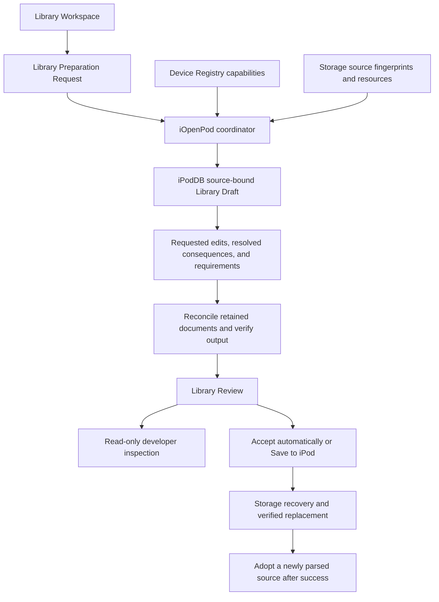

# Preparing Library Drafts

The [2026-09-11 writing audit](library-writing-audit-2026-09-11.md) documents the
album-edit/Podcasts fixes, native browse metadata and relationship checks, expanded
DEBUG diagnostics, and differences from the Original iOpenPod baseline. Tests
cover the supported write paths; they do not establish compatibility with every
firmware or native layout.

`IPodLibrary` owns retained iTunesDB, optional ArtworkDB, and optional PhotosDB
documents. Its semantic writing API edits those documents through the existing
shared writers. It reads no files, imports no GUI or Storage implementation, and
does not change its source.
The architecture is recorded in
[ADR-0021](adr/0021-prepare-library-drafts-over-retained-documents.md).

## Application request and ownership

The editor does not construct binary records or maintain a list of writer commands.
It edits the Library Workspace, which produces a complete desired Library Snapshot.
The controller captures that snapshot once in an immutable
`LibraryPreparationRequest`. The request includes its loaded Active iPod, workspace
generation and edit revision, and `delete_omissions=False` by default.

The global **Draft all changes** setting defaults to off. The controller then
prepares and automatically accepts each current draft, including pending changes
when the setting is turned off. On retains manual Review Changes and Save to iPod.
Both modes use the same source-bound preparation and verified Storage Transaction.
Failures retain the draft and open diagnostics without an automatic retry loop.
See [ADR-0073](adr/0073-apply-library-changes-automatically-by-default.md).



These identities have distinct meanings:

| Binding | What it guards |
| --- | --- |
| Captured Active iPod and its candidate Connection Generation | Preparation/save for another connection or loaded Library |
| Workspace generation and edit revision | Results arriving after edits, reloads, or a revert |
| Opaque iPodDB source revision | Applying semantic changes to different retained documents |
| Storage fingerprints | External file changes during preparation or before publication |

`iOpenPod.app.library_write` contains the request, result, progress, and service
contracts; it imports no Qt implementation. `LibraryWriteController` owns worker
lifetime, cancellation, stale-result rejection, and adoption. `DeviceCoordinator`
uses Device Registry capabilities and Storage evidence to supply iPodDB's inputs.
iPodDB keeps all document bindings and binary reconciliation private. Storage
continues to own physical mutations and recovery.

For a developer invoking the application service directly:

```python
import threading
from iOpenPod.app.library_write import LibraryPreparationRequest, WriteProgress

request = LibraryPreparationRequest(
    snapshot=workspace.desired_snapshot(),
    source=active_ipod,
    workspace_generation=workspace.generation,
    workspace_revision=workspace.revision,
    delete_omissions=workspace.delete_omissions,
    artwork=workspace.artwork_assets,
    media=workspace.media_sources,
)
progress: list[WriteProgress] = []
review = coordinator.prepare_library(request, progress.append, threading.Event())
```

The GUI uses the controller to run this off-thread. The direct call is synchronous.
The workspace opts into deletion after an explicit Remove from Library action;
the controller captures that choice. A Track missing from an ordinary request is
still protected by default. Request capture and preparation perform no physical
saving. Save requires the exact review issued for the current source and publishes
one recoverable transaction containing all required song, thumbnail, ArtworkDB,
PhotosDB, and iTunesDB changes, followed by obsolete-media removal.

## Requested edits and resolved consequences

The draft is the complete desired state of caller-owned choices. It also carries
unchanged projected diagnostics and derived fields. For example, edit lyrics text;
iPodDB derives the lyrics flag. Choose artwork; prepared assets establish its count.
Folders supply hierarchy, while their saved aggregate entries are generated.
iOpenPod applies Smart Playlist rules and saved matches together before submission.

`analyze()` returns direct `changes` with precise paths such as `metadata.podcast`.
Its optional `resolution` contains the effective common snapshot, `generated_changes`,
`effects`, and preservation constraints. Effects refer to requested changes by their
indexes in `plan.changes`. A podcast flag edit can therefore explain the generated
Podcasts Playlist before database output exists. The original draft stays unchanged.

```python
plan = source.analyze(source.begin_draft(desired), target)
if plan.resolution is not None:
    generated = plan.resolution.generated_changes
    consequences = plan.resolution.effects
result = source.prepare(plan, resources)
```

The private execution decisions include native identity assignments, affected
folders and datasets, playlist order, podcast groups, browse indexes, and artwork
ownership. Reconciliation consumes those decisions. Public plan summaries cannot
bypass validation: preparation derives them again from the source-bound draft.
Artwork layout comes from the identified Device Profile; file allocation needs a
captured inventory, which may be empty for the first cover;
the Prepared Library contains their exact resulting bytes and identities.

The field policy in `iPodDB/library/_field_policy.py` owns semantic editability and
inverse-field bindings. Missing or duplicated model-field policies block analysis.
Native Chapter, Smart Rule, and diagnostic payload details retain their existing
specialized validation. No-op resolution has no generated effects and preserves
every retained database file exactly.

## Inspect the draft and the write

Open **Review Changes → Inspect write…** to view a captured JSON report. Refresh
updates it from current application state; Copy report copies exactly that displayed
capture. Selecting an individual change in Review Changes shows its original,
desired, resolved, and prepared field values. Playlist entries include both occurrence and
Track identities, so duplicate membership can be inspected.

From a debugger, use `controller.request`, `controller.review`, `controller.trace`,
and `controller.inspection_json()`. The independent renderer is also available:

```python
from iOpenPod.app.library_write_inspection import inspect_library_write

report = inspect_library_write(request, review, state="ready")
```

The report includes:

- Captured connection, source fingerprint/revision, workspace revision, and omission policy.
- Changed fields with before/desired/resolved/prepared values and allocated output IDs.
- Generated records, native consequences, requested causes, and preservation constraints.
- Required media/artwork/inventories and the resource evidence supplied by the coordinator.
- Output sizes and SHA-256 hashes, retained file/range dependencies, and diagnostics.
- The controller's preparation/save stages and terminal state, when called through it.
- Worker-stage durations, separate from the controller's queued progress trace.

No prepared value exists after a blocked preparation. A prepared value can differ
from the desired value because of allocated native identities or reported format
quantization. Playlist occurrence IDs are scoped to a source revision; reparse can
assign new occurrence IDs while preserving native per-occurrence metadata.

Pure callers can observe `source.prepare(plan, resources, progress=callback)`.
The callback receives `WritePhase` values as stages are entered: validation,
resources, reconciliation, artwork, serialization, signing when required, and
verification. No-op preparation only validates and losslessly serializes retained
documents. The returned result establishes success; merely entering verification
does not. A callback exception propagates to the caller without becoming a binary
encoding issue. The coordinator uses this seam for cooperative cancellation between
stages; an individual large stage is still synchronous.

`result.measurements` records elapsed worker time between stage entries, including
the terminal stage. Validation time includes semantic resolution. These measurements
are observational and excluded from result equality; they do not claim that a stage
succeeded. They complement functional large-library tests rather than imposing
machine-dependent performance assertions.

The controller retains the last 256 stage events for the latest attempt, including
cancellation, invalidation, and save outcomes. Elapsed times include queued delivery
to the GUI thread. A stale review remains inspectable, but its saveable result is
discarded. Beginning another preparation replaces the previous inspection context.

Reports are bounded by `InspectionLimits`: by default 200 changes, 50 items per
sequence, 512 characters per text value, 12 levels, and a 12,000-value traversal
budget. Omission markers and `truncated` disclose incomplete views. A selected
change gets a separate budget. Binary bytes appear as size/hash summaries; signing
GUIDs and private Chunk trees are not dumped. Library metadata does appear, so
reports are copied only on request and are not automatically logged.

The JSON schema is `iopenpod.library-write-inspection`, version 2. It is an
observational format, not a way to reload a draft or replay a save. The original
typed Python records remain the complete interface. Restoring a draft across source
reloads would need explicit identity rebinding and conflict handling; see
[ADR-0023](adr/0023-capture-write-requests-and-inspect-them-without-replay.md).

## Submit a complete desired snapshot

```python
from dataclasses import replace
from iPodDB.library import IPodLibrary, WriteResources, WriteTarget

source = IPodLibrary(itunes_bytes)
original = source.snapshot
desired = replace(
    original,
    playlists=(
        replace(original.playlists[0], name="Train journeys"),
        *original.playlists[1:],
    ),
)
draft = source.begin_draft(desired)
plan = source.analyze(draft, WriteTarget())  # unsigned target in this example
result = source.prepare(plan, WriteResources())
if result.prepared is not None:
    candidate_bytes = result.prepared.itunes
```

The application supplies actual artifact requirements in `WriteTarget`; a signed
source cannot silently become unsigned. A Library Draft from another adapter, even
one loaded from identical bytes, is rejected. `with_artwork` and `with_photos`
produce new source revisions. Analysis is immutable and preparation revalidates it,
so replacing a plan's diagnostics cannot bypass validation.

Omitting an existing visible Track, Playlist, Photo, or user Photo Album requests
deletion, which is blocked by default. Intentional deletions require an explicit
opt-in for that draft:

```python
draft = source.begin_draft(desired, delete_omissions=True)
```

With `delete_omissions=False` (the default), each omitted record produces a
`draft.deletion_not_enabled` error and no candidate is returned. Omitted records
are not silently restored: the snapshot remains a complete desired state.
The flag is keyword-only and belongs to the immutable draft; enabling it does not
affect later drafts. Preparation rechecks it even if the caller removes plan errors.
Callers must not enable the flag merely because analysis detects omissions; the
opt-in should come from an intentional deletion action. The current application
preparation request keeps the protected default.

The opt-in does not bypass dependency or resource validation. Remove dependent
Playlist entries and Photo Album occurrences as part of the same desired state.
Removing an entry from a retained Playlist or Photo Album is a membership edit, not
deletion of its Track or Photo, and needs no omission opt-in. Hidden Master
Playlists, firmware categories, artwork records, and unknown datasets are not
omitted records. A no-op reproduces every retained database file exactly. The
source's snapshot and `serialize()` result remain unchanged after success or
failure.

## Photo edits

Photos participate in the same complete desired Library Snapshot, source revision,
analysis, review, preparation, and adoption contract as iTunesDB edits. The
Application Layer does not submit PhotosDB commands or binary records. A successful
photo-only preparation leaves iTunesDB and ArtworkDB byte-identical and returns a
reparsed, losslessly reserialized PhotosDB candidate.

The current writable surface is intentionally narrow:

- A retained Photo can change rating, original date, and taken date.
- A retained user Photo Album can change name, ordered Photo membership, slideshow
  booleans and durations, and its optional slideshow-music Track reference.
- A retained user Photo Album can be removed only when the draft carries explicit
  omission-deletion intent.
- An empty user Photo Album can be appended with a unique identity and the selected
  Device Profile's explicit non-master MHBA creation type.
- A retained Photo can be removed with explicit omission-deletion intent when every
  Photo Album occurrence is removed in the same desired state. The Master Photo
  Album admits only that exact membership consequence.
- Photo addition, direct Master Photo Album editing or deletion, representation
  edits, and file-format edits are blocked.

The writer resolves slideshow music from the common Track identity back to the
native persistent Track identity. It rebuilds only affected typed Photo records,
preserving unknown fields, unrelated children, and retained membership records when
possible. Final verification reparses PhotosDB, compares requested semantic values,
checks unchanged database artifacts, and rejects dangling Photo or Track references.
See [ADR-0053](adr/0053-project-photos-into-library-drafts.md) and
[ADR-0058](adr/0058-create-empty-photo-albums-through-library-drafts.md), and
[ADR-0059](adr/0059-delete-photos-through-library-drafts.md).

## Occurrences and field ownership

`PlaylistEntry(entry_id, track_id, position)` identifies an occurrence within its
Playlist and source revision. `position` is the optional value stored in the
entry's MHIP type-100 child: zero-based for ordinary entries, with native episode
IDs used by grouped Podcasts. Move existing entries to reorder duplicates. Keeping
their source position values is valid; preparation derives the final ordinary
positions and Podcast episode IDs. Newly supplied positions must match the desired
order. The
`playlist_entries(track_ids, previous_entries)` helper retains matching occurrences
in order, allocates new identities for new occurrences, and assigns consecutive
positions. `order_playlist_entries(entries, tracks, sort_order)` applies a supported
stable Playlist Sort Order and refreshes those positions. `track_ids` is a derived
read convenience and is no longer a constructor argument. Folder entries are empty
in the public model; their native Track aggregation is computed recursively.

| Values | Ownership |
| --- | --- |
| Track text, rating, counts, playback preferences, dates, chapters | Editable semantic fields, validated before encoding |
| Duration, media types, size, bitrate, location, codec description, sample rate, gapless facts | Require `PreparedMedia` for additions or changes |
| `Track.ipod` | Read-only native diagnostics |
| Artwork count and lyrics-present flag | Derived from artwork and lyrics edits |
| Playlist name, description, parent, entries, Playlist Sort Order, supported rules | Editable; identities, positions, and dependencies are validated |
| Smart Playlist preview results | Pure previews do not mutate entries; applying changed rules in the application updates saved matches before preparation |
| Photo rating and dates | Editable retained metadata with bounded integer validation |
| Photo representations, source size, and file formats | Read-only until an asset workflow exists |
| Photo Album name, membership, slideshow preferences, and music Track | Editable for retained user albums; Master album, role, and native diagnostics are read-only |

Dates are Unix seconds with zero meaning absent; the inverse conversion uses the
source device timezone and the unsigned iPod epoch range. Unknown native bits and
unchanged timestamp/string representations remain intact. Volume quantization
produces a warning and the actual stored value in the resulting snapshot.
Normalization gain is canonicalized to the actual stored value without a warning
because its native representation is expected to be quantized. Unsupported rule
representations survive untouched.

## Supply resources through typed inputs

### Embedded lyrics

Lyrics require both the iTunesDB presence flag and text embedded in the media file.
The existing type-10 MHOD projection remains for application compatibility; it is
not evidence that stock firmware can display the lyrics. See the
[libgpod/GTKpod research](research/itunesdb-lyrics.md) and
[ADR-0075](adr/0075-publish-lyrics-with-media-file-tags.md).

Changing or clearing `metadata.lyrics`, or supplying new/replacement media with
known lyrics, adds the Track to `plan.required_lyrics`. Preparation requires a
`PreparedLyrics(track_id, lyrics, file)` resource whose text matches the draft and
whose `FileDependency` describes the resulting tagged file. Removing requirements
from a public plan cannot bypass this check. File size and the retained secondary
size are reconciled from that resource without changing codec or gapless facts.
Ordinary media replacement still requires `PreparedMedia`; both resources must
identify the same final bytes when supplied together.

The Application Layer captures media through Storage, transforms private bytes,
and reparses the lyrics tag before creating a review. MP3/WAV/AIFF use ID3 `USLT`;
MP4 containers use `©lyr`. Only lyric frames/atoms are replaced, all prior `USLT`
variants are removed on clearing, and full Track metadata is not materialized.
Existing ID3v2.3/v2.4 versions are preserved; new tags follow Original iOpenPod's
ID3v2.3 UTF-16 policy. No new padding is added. This is independently required of
any optional full metadata policy for Rockbox compatibility.
Legacy ID3v2.2 edits are blocked because implicit conversion can discard unknown
frames; an already matching file is retained byte-for-byte.

The issued Storage Transaction publishes captured media before the database and
retains originals for joint recovery. A changed or missing device file, unsafe
path, shared media path, unsupported format, failed tag verification, or insufficient
space prevents a database-only save. Incoming music retains the Host source and
reads its embedded lyrics into the draft. Lyrics media, captured artwork prefixes,
and generated artwork share a 512 MiB retained-memory budget. Complete overflow
content uses private Host disk storage with file-specific warnings; the budget
does not require truncation or splitting batches. Photo Sync uses the same policy
in its own workspace. iPodDB accepts caller-owned readable content and output
buffers, verifies hashes with bounded reads, and never opens paths itself. Staging
survives through publication and is cleaned when its owner finishes or retires.
Individual image and device-format limits still apply. See ADR-0117.

No-op drafts and unrelated edits neither read nor rewrite media tags. A retained
flag without database text remains untouched: an empty projected string alone is
not authorization to clear unobserved file-only lyrics. Loading those lyrics into
the editor and general Sync execution remain separate work. Automated payload and
transaction tests do not establish physical-firmware compatibility.

### Replace content with unchanged metadata

An existing Track's replacement file can have exactly the same projected metadata,
including location, size, and duration. Request that replacement explicitly:

```python
draft = source.begin_draft(desired, replace_media=(track_id,))
plan = source.analyze(draft, target)
result = source.prepare(plan, WriteResources(media=(prepared_media,)))
```

The keyword-only `replace_media` tuple belongs to this source-bound Library Draft.
Each ID must occur once and identify a source Track retained in `desired`; unknown,
added, omitted, or duplicate IDs block preparation. Media-owned field changes and
additions retain their existing resource requirements. An explicit replacement
combined with metadata changes still requires only one Prepared Media record.

Analysis reports subject `media`, action `replace`, and the Track ID in `changes`.
The corresponding `media.replacement` effect points to that requested change. It
does not claim that a projected Track field changed or trigger unrelated browse,
Playlist, or artwork consequences. Preparation recomputes these requirements from
the draft. Supplying media resources or editing public plan summaries cannot
request replacement by itself.

Even an equal snapshot follows resource validation, native codec reconciliation,
serialization, required signing, and independent verification. Keep submitted
native diagnostics unchanged; the Prepared Library's snapshot reports the resulting
native values. It returns the replacement file's captured dependency even if all
database bytes remain identical. Existing format/signature restrictions still
apply. Preparation does not access or publish files; application replacement
capture and saving remain future work. See
[ADR-0034](adr/0034-bind-media-replacement-intent-to-library-drafts.md).

### Captured media and source files

`PreparedMedia` supplies all native codec fields explicitly, plus a `FileDependency`
containing a validated device-relative name, size, and SHA-256. Semantic media facts
come from the desired Track. This input represents caller-owned media inspection;
it neither probes nor copies the media. Extra or contradictory resources are errors.
Preparation validates supplied resources even when the draft is unchanged. Valid
captured inventory and source-file context may accompany a no-op; unrequested media
facts, duplicate identities or paths, invalid inventory, and source bytes that do
not match their captured fingerprint block output. A valid no-op still returns the
original database bytes without reconciliation or signing.

Its keyword-only `content: MediaContent` describes the caller-observed content,
independently of `Track.media_types`. Existing callers default to `AUDIO`. Embedded
cover images do not make audio into `AUDIO_VIDEO`.

| Content | Playback duration | Audio sample rate |
| --- | --- | --- |
| `AUDIO`, `AUDIO_VIDEO` | Positive | Positive |
| `VIDEO` (no audio) | Positive | Zero |
| `DOCUMENT` | Zero | Zero |

Content without audio also requires zero sample count, pregap, postgap, gapless
flag, and audio payload size. These requirements apply to supplied media resources;
unrelated edits continue to preserve retained source facts. The content declaration
neither derives native codec flags nor establishes compatibility with a Device
Profile. Document records can be prepared, but iPodDB does not inspect PDF/EPUB bytes
or establish that a device displays them.

The application's `MediaInspector.inspect` now observes actual container and stream
facts through FFprobe over a Storage-captured temporary Host file. It preserves all
streams, embedded pictures, exact timing, chapters, and tags, including absent facts.
It does not infer Podcast/audiobook/movie intent or manufacture `PreparedMedia`.
`MusicImporter` uses these observations for bounded music compatibility, semantic
Tracks, native codec mapping, and incoming-file publication through the existing
review. Full-file verification where required, exact gapless analysis, conversion,
and application media replacement remain separate work. See
[ADR-0031](adr/0031-inspect-captured-host-media-before-planning-imports.md) and
[ADR-0032](adr/0032-add-inspected-music-through-library-reviews.md). The Sync engine
and transcoder remain future work.

`ArtworkAsset` associates a new opaque artwork ID with bounded `ArtworkPixels`
(RGB888, positive dimensions, at most 8192 on an axis and 32 Mi pixels). Set the
desired Track's artwork ID to that ID. Existing image IDs cannot be overwritten
with replacement pixels. Reusing a saved image requires inventory evidence for
its ranges; zero clears the association. Sharing one new asset between several
Tracks allocates one new image record where sparse artwork and Track headers
support direct references. Otherwise, each Track receives a distinct image record
and reverse Track link while sharing immutable thumbnail ranges. Per-Track artwork
mappings carry `IdentityMapping.track_id`.

`WriteResources.file_inventory` is a complete captured inventory for artwork file
allocation. `SourceFile` supplies exact bytes and their fingerprint for an existing
file being extended. A full shard can be retained without reading its bytes; a
partially full shard requires its verified prefix. Allocation uses only the
`F<format>_<shard>.ithmb` policy, checks case-insensitive collisions, and never
compacts, reuses holes, or deletes files. Changed file outputs include the complete
prefix plus zero-filled frame alignment and appended images. Missing or duplicate
affected datasets and conflicting MHIF image sizes block preparation.

Packed RGB565 and RGB555 variants, rectangular rotated RGB565, UYVY, tightly packed
I420, and JPEG use explicit codec layouts. I420 accepts the catalog's aggregate
row-byte value as well as a tightly packed luma stride. Resizing preserves aspect
ratio and centers the image on black. Packed row padding is zero-filled. Unsupported
padding and odd subsampled dimensions are rejected. ArtworkDB file allocation
requires a consistent image size per format; variable JPEG sizes cannot share one
MHIF entry. All catalog cover formats have fixed-size rasters.

For a first ArtworkDB, the application supplies the known Device Profile's creation
value through `WriteTarget.artwork_root_value`. No existing artwork or additional
format files are needed. iPodDB starts image IDs at 100, creates all three datasets,
and includes every cover layout and the evidenced empty type-6 auxiliary body.
Retained roots keep their original value. See
[ADR-0033](adr/0033-create-artworkdb-from-catalog-capabilities.md).

Structural Track edits require captured playback-sidecar context.
`pending_playback_sidecars=False` means the caller established their absence or
captured their preservation/consumption in the Library transaction. `None` means
unchecked and `True` means unhandled data; both block structural edits. Loaded
playback deltas and OTG Playlists also require this context. Preparation projects
them into verified output without modifying the retained source. The Application
Layer runs this preparation and save immediately during device selection, archiving
consumed bytes and removing active inputs only with the successful Storage
Transaction. The Active iPod is published after that commit. See
[playback sidecars](playback-sidecars.md).

## Results, verification, and review

`LibraryWriteResult.issues` retains stable codes, severity, phase, record/field,
actionable messages, and optional Chunk path/offset. `prepared` is absent whenever
any error occurs. Warnings can accompany a Prepared Library containing:

- iTunesDB or iTunesCDB, optional SQLite companion set, optional ArtworkDB, and
  optional PhotosDB bytes;
- complete changed artwork-file bytes;
- captured media and retained-file fingerprints, plus retained artwork filename/range dependencies;
- the reparsed resulting snapshot and allocated Track, Playlist, and artwork mappings;
- the source revision to which this result belongs.

Retained artwork filenames are source metadata, not permission to open paths.
Their range manifest also identifies photo assets. A missing captured fingerprint
does not imply that an unmodified asset has been read or verified. Physical saving
must establish the required source dependencies before committing.

Preparation reparses its finalized bytes, checks lossless reserialization, desired
semantic values, newly dangling references, retained unknown datasets, Photo data,
and changed artwork ranges. For compressed targets it verifies the physical CDB
framing and signature after zlib level-1 compression. For SQLite targets it opens
all five generated databases, runs any device-supplied SysInfoExtended postprocess
command set in an isolated in-memory database group, creates and verifies
`Locations.itdb.cbk`, and returns all six artifacts as one generation. Artwork
verification also checks target layouts, both
image sizes, file-format records, allocation alignment, next image ID, native Track
flags, and required reverse links. HASH58 uses the supplied eight-byte FireWire GUID.
HASH72 uses the selected device's retained HashInfo IV and random bytes. HASHAB uses
the FireWire GUID and the clean-room `calcHashAB` WebAssembly implementation. Fixed
reference vectors cover HASH58 and HASHAB; HASH72 has envelope, round-trip, and
corruption checks against its retained inputs. Signed ArtworkDB remains an explicit
blocker.

Device Registry describes the binary/CDB checksum separately from the SQLite CBK
checksum. Nano 5 uses HASH58 for iTunesCDB and HASH72 for the SQLite checksum book;
Nano 6 and 7 use HASHAB for both. Missing HashInfo or FireWire GUID evidence blocks
changed output. iTunesCDB is the sole readable Library authority: device selection
does not require or parse the SQLite files. A true no-op returns the exact retained
CDB and does not touch SQLite. Every CDB-changing save generates and publishes all
six SQLite artifacts from the independently reparsed candidate snapshot, replacing
missing, stale, or damaged companions as one transaction generation.

SysInfo and SysInfoExtended are optional metadata sources (ADR-0115). Signing uses
connection-bound hardware evidence first, then either metadata file when hardware
lacks a transport identifier. Missing or unusable postprocess declarations use the
built-in SQLite projection on every supported profile, including Nano 5. Usable
commands remain supported and their exact source bytes become a publication
precondition; a failed command or invalid generated database still blocks output.
Metadata that supplies no commands is not a postprocessing dependency.

Native Track checks compare reparsed codec flags, payload size, and file-size
mirrors against supplied `PreparedMedia` or retained source fields. The secondary
sample rate is checked when its semantic dependency changes and otherwise retained.
Existing persistent identities and their mirrors must remain unchanged; new
identities must be nonzero, distinct, and unreserved by either source identity.
These checks do not use reconciliation's generated field values as expectations.
Unchanged noncanonical source values are preserved, and failures identify the
Track, native field, expected/actual values, and artifact offset.

Defined MHIT fields are also checked against retained source values or the exact
semantic dependency that permits them to change. Shared Chunk Definitions supply
field locations and defaults. These checks cover media-type bits, video/playback
flags, the full fixed-point sample rate, and known opaque fields that projection
does not expose. Unmodeled header gaps and future extension bytes are preserved;
their failure diagnostics contain ranges and hashes rather than raw header dumps.
Retained floating-point sample rates keep their exact encoding, including signed
zero and NaN payload bits.

New Tracks and explicit media-classification changes update both video flags when
the MHIT header contains the secondary field. Its extent comes from the shared
Chunk Definition. Short retained headers keep their original size and omit the
absent mirror; unrelated metadata edits preserve existing flag mismatches. Native
verification derives the same requirement from source layout and requested
classification, independently of the writer's output.

Changing a sort override updates only bit zero of its MHIT indicator byte. Other
bits, including retained collation flags, and the two trailing indicator bytes
remain unchanged. Final verification checks both the presence bit and preservation.

Artwork verification independently preserves existing image locations and source
sizes, rejects duplicate output paths, and checks complete retained thumbnail
prefixes against the captured inventory's sizes and hashes. Replacing an image
selection may append new image data; it must not relocate retained images or
silently overwrite uncaptured source thumbnail files.

Affected existing dataset mirrors keep their own metadata and occurrences, including
duplicate Tracks. Empty Master-only mirrors accept the first Playlist. A source
with only dataset 3 gains a flat dataset 2 companion for affected edits; conflicting
existing counterparts block additions. New Playlists carry native identity mirrors
and the Original writer's display preferences. Master membership, known browse
indexes, album/artist/composer links, folder child rules and aggregates, and podcast
groups are reconciled and checked independently after reparse.

Album browse rows maintain title, artist, sort artist, Podcast RSS URL, and show
metadata. Shared optional values follow the Original writer: select the first
nonempty sort album artist in Library Track order, with sort artist as fallback,
and the first nonempty RSS URL. Relevant field edits and Track-order changes
refresh these values. Affected groups must resolve to native records with matching
metadata and valid representative membership; untouched source anomalies remain
preserved. See the [writing audit](library-writing-audit-2026-09-11.md) for remaining
grouping-policy differences from the Original writer.

Podcast grouping belongs only to dataset 3's special Podcasts playlist, including
its first episode. Episodes are grouped by album, with the resulting order reported
when it differs from the draft. Relevant podcast Track changes update special saved
membership and can create that Playlist when dataset 3 establishes target support.
Unrelated Smart Playlists and firmware category rules are not reevaluated. Dataset 5
retains its native category fields and metadata, including categories that carry a
Master flag. Ambiguous affected relationships block preparation; unrelated source
anomalies remain with warnings. See [ADR-0024](adr/0024-reconcile-and-verify-playlists-by-dataset.md).
Deleting a Track used for a Photo Album's slideshow music is blocked unless the
same draft clears or replaces that relationship.

The current GUI uses the Library Workspace's desired snapshot. Review Changes
runs through `DeviceCoordinator` and `LibraryWriteController` in the background,
checks source fingerprints before and after preparation, and rejects results after
edits, cancellation, disconnects, or session changes. Its grouped issues can navigate
to existing Track/Playlist pages. Unexpected exceptions are logged and shown as one
concise failure. Preparing leaves the workspace dirty. Save to iPod commits the
exact reviewed metadata, device-name, Playlist, Photo, artwork, and Track-removal candidate
in the background, holding workspace edits and device selection until the outcome
is known. Storage stages and verifies file writes, retains originals and a journal,
publishes thumbnail files followed by ArtworkDB, PhotosDB, and iTunesDB, then moves obsolete
media into recovery. Files referenced by surviving Tracks remain. Only success
adopts a new source and clears the draft. Failed or stale
results cannot overwrite current draft state. Successful saves automatically clean
their committed recovery files. The review displays save diagnostics and a retained
recovery path only when recovery or cleanup is still needed. See
[ADR-0093](adr/0093-complete-terminal-transaction-cleanup-automatically.md).

The workspace retains artwork assets and explicit deletion intent in each captured
request. The Track metadata editor exposes artwork clearing, while shared context
menus expose Remove from Library as a reversible draft edit. Source thumbnail
inventories, eligible prefixes, and removed media fingerprints are captured through
Storage. Review Changes lists planned file writes and recoverable removals with sizes
and hashes available in detail. Those descriptions cannot authorize saving a copied
or fabricated review.

Saving revalidates all retained database fingerprints, signing identity, captured file
preconditions, and any required positional sidecar inventory before publication.
Storage recovery copies are retained beneath `.iopenpod-recovery` through commit,
independently of Backup Snapshots. `inspect_transaction` and `restore_transaction` verify the entire
observation and original files before restoration; unrelated later edits block it.
Terminal cleanup follows verified saves; Sync defers it until its Library Sync
Helper update has been attempted. Selection automatically cleans matching completed
transactions only after all active journals have been checked for unfinished
recovery. Interrupted publication requires the existing restore-or-keep choice,
while an actual cleanup failure preserves its reason and journal location.
Automatic Library saves open warning diagnostics while retaining the saved Library
and clean draft; reloading automatically retries cleanup. Sync and selection
failures expose Retry Cleanup for remaining recovery files. The Track metadata
editor can choose, orient, square-crop, replace, or clear artwork and submits its
bounded RGB888 asset in the same revision-checked batch as metadata. For mixed
artwork, it can also consolidate the selection onto one existing cover from a grid
of unique decoded images. Backend music import also extracts embedded covers. See
[ADR-0030](adr/0030-bind-library-file-transactions-to-issued-reviews.md).

## Backend music import

Music import is available to Application Layer callers for an Active iPod. There is
no Add Music button, music file picker, or import progress dialog in the GUI.
`MusicImportController.start` inspects supplied Host paths in the background and
applies the complete batch as one draft edit. Callers explicitly request review and
save through `LibraryWriteController`; inspection does not open Review Changes or
publish files. The existing review/save workflow publishes the reviewed transaction.
Removing a pending Track or discarding the draft drops its media and artwork
resources without copying the song. Cancellation, disconnect, or a changed draft
prevents a late inspection result from being applied.

`MusicImporter.inspect` reads FFprobe facts and Mutagen cover/VBR metadata from one
Storage-captured Host snapshot. It accepts one audio stream, no motion video, mono
or stereo, positive duration, and a sample rate no higher than 48 kHz. Supported
encodings are MP3, AAC LC in M4A with an observed bitrate at most 320 kb/s, 16-bit
ALAC when the Device Profile supports it, and 16-bit PCM WAV/AIFF. Content inspection
selects the encoding and output extension independently of the input filename.
Unsupported files need preparation outside this workflow. Exact gapless fields
remain unset; neither inspection nor this compatibility policy proves full-file
decoding or playback on every firmware.

`LibraryWorkspace.add_songs` assigns temporary Track/artwork identities and retains
the selected Host path, size, and SHA-256 in `LibraryMediaSource`. The request
captures these with the desired snapshot. iPodDB allocates persistent identities,
native codec fields, Master/browse relationships, and cover records. The importer
chooses a fresh path under the Device Profile's Music directories; the coordinator
checks destination absence and composes song writes before artwork and databases.
Storage reopens each Host source while staging and verifies its size/hash before
publishing any file; a changed source or occupied destination invalidates the save.
Original Host files are never modified.

This path has been exercised on an MB565 Classic with an existing ArtworkDB:
one ALAC song, HASH58 iTunesDB, ArtworkDB, and all four RGB565 thumbnail formats
were saved and read back. The copied song decoded completely, the native Master
membership/signature verified, and existing thumbnail prefixes were preserved.
Firmware playback still needs hardware observation. Creating a first ArtworkDB
requires evidenced root metadata and remains blocked when that evidence is absent.
See [ADR-0032](adr/0032-add-inspected-music-through-library-reviews.md).

## Smart Playlist editing

`validate_smart_playlist`, `smart_value_kind`, and `smart_operators` describe the
shared supported contract. The editor supports nested all/any groups, text and
numeric metadata, checked/compilation/artwork/purchased conditions, Playlist saved
membership, Media Kind and Location choices, absolute UTC dates, relative periods
with selectable time units, limits, and selection order. Ratings display stars
and retain the exact 0–100 semantic scale. Date input uses whole seconds; encoding
applies the source database timezone. Playlist Folder references include descendant
saved membership, and draft Playlist references use allocated native IDs. Known
fields without trustworthy common Track values remain read-only and byte-preserved.

Creating a Smart Playlist or applying changed rules updates that Playlist's saved
matching entries in one workspace edit, retaining surviving occurrence identities.
Name-only edits, moves, previews, and identical rule submissions preserve saved
membership. Evaluate now explicitly refreshes the selected supported Smart Playlist
from the current Library draft and applies changed saved membership as a reversible
edit. Unrelated Smart Playlists are never reevaluated. Live updating stores the iPod
preference. The semantic writer never evaluates rules on its own.

Fixed nested/date/checkbox rule bytes from Original iOpenPod are retained in
`tests/fixtures/writing/original_smart_rules.json` with their generator's digest.
Matching is also exercised with 100,000 Tracks; the editor uses a bounded rule tree
rather than a widget per Track. Physical firmware verification remains necessary
for a target compatibility claim. See
[ADR-0035](adr/0035-author-evidence-backed-smart-playlist-choices.md).

## Metadata editing and normalization

Choose the iPod name in the sidebar to rename it. Apply, Return, or leaving the
field applies the name to the draft; Cancel or Escape discards it. This edits the
Master Playlist name, not the Host volume label.

Right-click selected Tracks or collection cards for Edit Metadata, Add to Queue,
Add to Playlist, ratings, flags, content advisory, volume adjustment, and Copy as
Text. A card acts on all its Tracks, independent of the Track table's search.
Ctrl+E opens the editor for the selection; the standard Copy shortcut copies Track
text. New Playlist creates and opens a Playlist containing the selected occurrences.
Regular Playlist tables also offer Remove from Playlist and Move Up/Down; moving
requires natural order without a filtered subset. Entry identities keep duplicate
occurrences distinct. No media-file removal or conversion is performed here.

The Playlist page and sidebar context menu offer Remove Playlist or Remove Folder.
The action is confirmed and staged in the same Library draft. Removing a folder
also removes every nested Playlist and folder. The iPod is unchanged until the
draft is reviewed and saved.

The metadata editor groups editable fields, supports search, and exposes native and
media-derived details read-only. Mixed values remain unchanged. Each field has an
explicit Apply checkbox and Reset action. Numeric, timing, chapter, date, and text
errors reject the entire selected batch. Dates accept ISO timestamps or Unix
seconds; a blank date clears it. Edits are staged until Review Changes and Save to
iPod. Editing does not rewrite media-file tags.

The Photo context menu and Ctrl+E open a smaller editor over the selected Photos.
It exposes only the supported rating, original-date, and taken-date fields while
keeping source size and representation facts read-only. Mixed values remain
unchanged until explicitly edited. Validation and stale-revision checks reject the
whole multi-Photo batch before the Library Workspace publishes one draft revision.
Dates use the same ISO timestamp or Unix-seconds input, with a blank value clearing
one displayed date and zero available to clear a mixed selection.

Normalize Tags under Maintenance scans the current desired Library in a worker.
Review the before/after table and profile warnings, optionally filter the preview,
then choose Apply. Filtering changes the preview, not the set of edits.
Closing cancels an in-progress scan. Any workspace edit, reload, or save lock makes
its result obsolete. Normalization follows the Original implementation's pass order
and is checked against captured fixtures in `tests/fixtures/normalization/`.

The application input contracts are `TrackUpdate` and `EditRevision`; their edits
use `TrackFieldEdit` from `iPodDB.library`. `edit_track_metadata` and
`metadata_edit_issues` share the writer's field ownership and validation. These
helpers produce common immutable records. The workspace still submits one complete
Library Snapshot to the existing preparation workflow.
